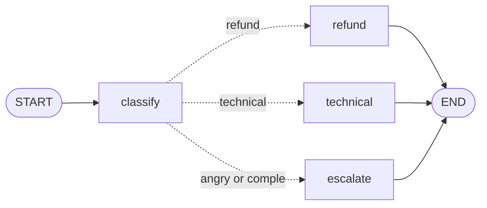

<h1>
  <picture>
    <source media="(prefers-color-scheme: dark)" srcset="docs/brand/telar-lockup-on-dark.svg">
    
  </picture>
</h1>

[](https://github.com/deeptelar/telar/actions/workflows/ci.yml)
[](https://central.sonatype.com/artifact/dev.deeptelar/telar-core)
[](LICENSE)
[](https://kotlinlang.org)

**AI agents and workflows for Kotlin, as small typed graphs.** You write each step as a `suspend`
function on a `data class` of your own, and connect the steps with arrows. Telar runs the graph on
every Kotlin platform, from a server to Android, iOS and the browser, and takes care of loops,
parallel steps, live streaming, save points, and pausing until a person approves.

**[Try it in your browser](https://deeptelar.github.io/telar-demo/):** Pixel Pizza is a
small game in which every stage runs a Telar graph, from two nodes in a row to a full agent
workflow. No account and no API key needed.

## An agent in a few lines

A model that calls your functions until it can answer. `toolAgent` is that loop, ready-made:

```kotlin
import dev.deeptelar.telar.agent.*
import dev.deeptelar.telar.anthropic.AnthropicChatModel
import io.ktor.client.HttpClient
import io.ktor.client.plugins.HttpTimeout
import kotlinx.serialization.Serializable

@Serializable
data class City(@Description("A city, for example \"Lisbon\"") val name: String)

// A tool: a function the model may call. Its input class becomes the schema the model reads.
val weather = Tool<City>("weather", "Returns today's weather in a city.") { city ->
    "Light rain and 17 °C in ${city.name}." // call your real service here
}

suspend fun main() {
    val client = HttpClient { install(HttpTimeout) { requestTimeoutMillis = 120_000 } }
    val model = AnthropicChatModel(client, apiKey = System.getenv("ANTHROPIC_API_KEY"), model = "claude-opus-5-5")
    val agent = toolAgent(model, tools = listOf(weather), system = "You are a travel assistant.")

    // The agent is a graph like any other: stream it, save it, pause it before a tool runs.
    agent.stream(AgentState("Do I need an umbrella in Lisbon today?")).collect { event ->
        event.textDelta?.let { print(it) } // the answer, piece by piece
    }
}
```

```kotlin
implementation("dev.deeptelar:telar-agent:0.1.0-alpha07")
implementation("dev.deeptelar:telar-anthropic:0.1.0-alpha07") // or telar-openai: OpenAI, Gemini, Ollama, Groq, ...
implementation("io.ktor:ktor-client-cio:3.6.0")                // any Ktor engine
```

The same agent with OpenAI, Gemini or a local Ollama model, a person who approves each tool call,
and a chat that continues across turns: [Agents with tools](#agents-with-tools).
When an agent alone is not enough, put it in a graph of your own with [`toolLoop`](#agents-with-tools)
next to plain Kotlin steps, as the [quick start](#quick-start) below shows.

## Why Telar

- **Your state is a plain `data class`.** Each node returns a `.copy()` of it, so a run is easy to
  test, print and save, and parallel branches cannot overwrite each other by accident.
- **Mistakes fail in `compile()`, not in production.** An unknown node, a node nothing leads to, or
  two parallel nodes with no rule to merge their results are reported before anything runs.
- **Pause anywhere, continue later.** Stop before a node, or call `interrupt` from inside one when
  it finds out it needs a person. The run is saved, and `resume` continues it hours later, in
  another process. `history` and `fork` go back to any earlier step.
- **Every Kotlin platform.** The core depends only on kotlinx-coroutines and runs on the JVM,
  Android, iOS, macOS, Linux, Windows, JS and Wasm. Agents, models and checkpoints work there too,
  down to runs saved in the browser's `localStorage`.
- **Coroutines all the way.** Nodes, edges and models are `suspend` functions. Cancellation works
  as you expect, and parallel nodes use structured concurrency.
- **Any model, small surface.** Claude, OpenAI, Gemini, Ollama and every server with the API of
  OpenAI, plus any LangChain4j model on the JVM. `ChatModel` is one function, so a model of your
  own, or a fake one in a test, takes a few lines.

### Telar and other Kotlin libraries

Kotlin has other good choices for AI agents. This is how we see the differences; if something here
is wrong or out of date, please [open an issue](https://github.com/deeptelar/telar/issues).

| | Telar | [Koog](https://github.com/JetBrains/koog) | [LangGraph4j](https://github.com/langgraph4j/langgraph4j) | [LangChain4j](https://github.com/langchain4j/langchain4j) |
|---|---|---|---|---|
| **What it is** | A graph engine for agents and workflows | JetBrains' framework for AI agents | A Java port of LangGraph | A Java toolkit for LLM apps |
| **Platforms** | JVM, Android, iOS, macOS, Linux, Windows, JS, Wasm | JVM, Android, iOS, JS, Wasm | JVM (Java 17+) | JVM (Java 17+) |
| **Workflow state** | Your own immutable `data class` | Values passed between the nodes of a strategy, and the agent's storage | A map of channels with reducers | Mostly the conversation memory |
| **Stage** | Alpha: the API can still change | Stable `1.x` | Stable `1.x` | Stable `1.x` |
| **Best at** | Workflows with typed state, checks before a run, pauses and save points, on every platform | A complete agent platform: many providers, MCP, tracing, backed by JetBrains | LangGraph's design on the JVM, from Java | Integrations: models, vector stores, RAG |

Choose Telar when the workflow itself is the hard part: several steps, branches that join, people
who approve, runs that must survive a restart, and state you want to read as ordinary Kotlin. If you
need a large set of ready-made integrations or a stable API today, Koog or LangChain4j are the
safer choice. Telar works with LangChain4j: [`telar-langchain4j`](#ai-models) turns any of its
models into a `ChatModel`.

> Telar is an independent project inspired by [LangGraph](https://github.com/langchain-ai/langgraph).
> It is not affiliated with or endorsed by LangChain, Inc.

**Contents:** [Why Telar](#why-telar) · [The idea](#the-idea) · [Quick start](#quick-start) · [Installation](#installation) ·
[Tutorial](#tutorial) · [Guides](#guides) · [Errors](#errors) · [Samples](#samples)

## The idea

There are three words to learn:

| Word | What it is | In the quick start below |
|---|---|---|
| **State** | The data of one job. A `data class` that you design. | A support email: who sent it, what it says, its category, the reply |
| **Node** | One step of the work. A function that receives the state and returns an updated copy. | `classify`, `refund`, `technical`, `escalate` |
| **Edge** | An arrow from one node to the next. A *conditional* edge chooses the next node by looking at the state. | After `classify`, go to the node of the email's category |

Every run begins at `START` and finishes at `END`.

## Quick start

A customer support agent for email. It reads an email, decides which of three categories it belongs
to, and writes the reply for that category:

- **refund**: the customer wants money back,
- **technical**: something does not work,
- **escalation**: the customer is angry, or the email is too complex or unclear for an automatic
  reply, so a person takes over.



```kotlin
import dev.deeptelar.telar.*

enum class Category { REFUND, TECHNICAL, ESCALATION }

// The state: everything the graph knows about one email.
// It is immutable (only `val`): a node never changes it, it returns an updated copy.
data class SupportEmail(
    val sender: String,              // input
    val body: String,                // input
    val category: Category? = null,  // filled in by the "classify" node
    val reply: String = "",          // filled in by one of the reply nodes
)

// Decides what an email is about. A real agent would ask an AI model here (see "AI models" below).
// Plain Kotlin keeps this example runnable without an API key.
fun categoryOf(body: String): Category {
    val text = body.lowercase()
    val angry = listOf("unacceptable", "furious", "worst", "!!").any { it in text }
    val wantsRefund = listOf("refund", "money back").any { it in text }
    val hasProblem = listOf("error", "crash", "not working").any { it in text }

    return when {
        angry -> Category.ESCALATION                      // an upset customer gets a person
        wantsRefund && hasProblem -> Category.ESCALATION  // two requests in one email: too complex
        wantsRefund -> Category.REFUND
        hasProblem -> Category.TECHNICAL
        else -> Category.ESCALATION                       // not sure what this is, so a person reads it
    }
}

// StateGraph<SupportEmail> { ... } describes the graph. The type says which state it works on.
val graph = StateGraph<SupportEmail> {
    // A node is a named step: it receives the state and returns an updated copy.
    // This one fills in `category` and leaves the rest of the email as it is.
    val classify = node("classify") { email -> email.copy(category = categoryOf(email.body)) }

    // One node per category. Each writes the reply; only one of them runs for a given email.
    val refund = node("refund") { email ->
        email.copy(reply = "Hi ${email.sender}, your refund is on its way. It takes 3 to 5 days.")
    }
    val technical = node("technical") { email ->
        email.copy(reply = "Hi ${email.sender}, please update the app and try again. Here is our guide.")
    }
    val escalate = node("escalate") { email ->
        email.copy(reply = "Hi ${email.sender}, a colleague from our team will reply to you personally today.")
    }

    // Every run begins at START. This edge says: run `classify` first.
    START then classify

    // A conditional edge picks the next node by looking at the state.
    // `targets` lists every node it may pick, so compile() can check that no node is left out.
    conditionalEdge(classify, targets = setOf(refund, technical, escalate)) { email ->
        when (email.category) {
            Category.REFUND -> refund        // return the node to run next
            Category.TECHNICAL -> technical
            else -> escalate
        }
    }

    // After the reply is written there is nothing left to do, so each path goes to END.
    refund then END
    technical then END
    escalate then END
}.compile() // Checks the graph (unknown names, nodes nothing leads to) and makes it runnable.

suspend fun main() {
    // invoke() runs the graph from START to END with this email as the starting state.
    val result = graph.invoke(SupportEmail(sender = "Ana", body = "I was charged twice, I would like a refund."))

    // result.state is the final state: the email, with `category` and `reply` filled in.
    println("${result.state.category}: ${result.state.reply}")
    // REFUND: Hi Ana, your refund is on its way. It takes 3 to 5 days.
}
```

This is the [`QuickStart`](samples/src/main/kotlin/dev/deeptelar/telar/samples/QuickStart.kt) sample. To
run it from a clone of this repository:

```bash
./gradlew :samples:runQuickStart
```

```
REFUND: Hi Ana, your refund is on its way. It takes 3 to 5 days.
TECHNICAL: Hi Ben, please update the app and try again. Here is our guide.
ESCALATION: Hi Cleo, a colleague from our team will reply to you personally today.
```

## Installation

```kotlin
dependencies {
    // The graph builder and the engine. This is all the quick start needs.
    implementation("dev.deeptelar:telar-core:0.1.0-alpha07")

    // Optional modules. Add only the ones you use.
    implementation("dev.deeptelar:telar-serialization:0.1.0-alpha07")      // save @Serializable states
    implementation("dev.deeptelar:telar-checkpoint-file:0.1.0-alpha07")    // save runs as JSON files
    implementation("dev.deeptelar:telar-checkpoint-browser:0.1.0-alpha07") // save runs in a browser's localStorage (JS and Wasm)
    implementation("dev.deeptelar:telar-agent:0.1.0-alpha07")              // chat models, tools and the tool-calling agent
    implementation("dev.deeptelar:telar-anthropic:0.1.0-alpha07")          // call Claude, on every platform
    implementation("dev.deeptelar:telar-openai:0.1.0-alpha07")             // call OpenAI, Ollama and compatible servers, on every platform
    implementation("dev.deeptelar:telar-langchain4j:0.1.0-alpha07")        // call AI models through LangChain4j (JVM)
    implementation("dev.deeptelar:telar-typesafe:0.1.0-alpha07")           // ask Jev, a decision model, on every platform
}
```

> Until `0.1.0-alpha05` the project was called langgraph-kt, and its artifacts were
> `io.github.cuento3yllevo2:langgraph-kt-*`. The [changelog](CHANGELOG.md) says how to update.

| Module | Targets | Purpose |
|---|---|---|
| `telar-core` | JVM/Android, iOS, macOS, Linux, Windows, JS, Wasm | Graph builder, execution engine, checkpointing interfaces |
| `telar-serialization` | same as core | `KotlinxStateSerializer` for `@Serializable` states, `CheckpointCodec` for custom checkpointers |
| `telar-checkpoint-file` | same as core (Node.js only for JS/Wasm) | `FileCheckpointer`, one JSON file per thread |
| `telar-checkpoint-browser` | JS and Wasm in a browser | `LocalStorageCheckpointer`, runs that survive a page reload |
| `telar-agent` | same as core | `ChatModel`, `Tool`, and the tool-calling agent: `toolAgent` / `toolLoop` |
| `telar-anthropic` | same as core | `AnthropicChatModel`, Claude through Ktor |
| `telar-openai` | same as core | `OpenAiChatModel`: OpenAI, Ollama and other servers with the Chat Completions API, through Ktor |
| `telar-langchain4j` | JVM (Java 17+) | `LangChain4jChatModel` and `chatNode` / `chatMessagesNode` for LangChain4j 1.x models |
| `telar-typesafe` | same as core | `TypeSafeDecisionModel`: Jev, the decision model of TypeSafe AI, through Ktor |

Requires Kotlin 2.x. JVM artifacts target Java 11, except `telar-langchain4j`, which needs
Java 17 because LangChain4j does.

### Status

Alpha. `0.1.0-alpha07` is the latest release, and it is on Maven Central. The API may still change
before `1.0`; the [changelog](CHANGELOG.md) lists what changes in each version, and the
[roadmap](ROADMAP.md) lists what is planned.

## Tutorial

New to agent workflows, or to graphs? The [tutorial](docs/README.md) starts from zero and has eight
levels, like a game: a line of nodes, a choice, a loop, parallel work, pausing for a human, an agent
with tools, errors, and a complete workflow. Every level is a small program you can run, for example
`./gradlew :samples:runLevel1`, and matches a stage of the
[Pixel Pizza game](https://deeptelar.github.io/telar-demo/). The
[cheat sheet](docs/cheat-sheet.md) has every term and every call on one page.

## Guides

Each guide is the short version of one feature. The tutorial explains the same features slowly.

| I want to | Guide |
|---|---|
| Show progress while a graph runs | [Streaming](#streaming) |
| Wait for a person to approve something | [Human-in-the-loop](#human-in-the-loop) |
| Run several steps at the same time | [Parallel branches](#parallel-branches) |
| Repeat a step until the result is good | [Loops](#loops) |
| Use a graph as one step of another graph | [Subgraphs](#subgraphs) |
| Let an AI model do the work of a node | [AI models](#ai-models) |
| Let a fast model pick the next step | [Decision models](#decision-models) |
| Let an AI model call my functions | [Agents with tools](#agents-with-tools) |
| Draw a graph or test its shape | [Inspecting a graph](#inspecting-a-graph) |

### Streaming

`invoke()` returns when the run is over. `stream()` runs the same graph and returns a `Flow` that
reports what happens while it runs. With the `graph` of the quick start:

```kotlin
graph.stream(SupportEmail(sender = "Ana", body = "I would like a refund.")).collect { event ->
    when (event) {
        // A node is about to run. A UI can show a spinner next to it.
        is GraphEvent.NodeStarted -> println("${event.node} started")
        // A running node reported something with reportProgress(). See below.
        is GraphEvent.NodeProgress -> println("${event.node} reports ${event.value}")
        // A node that runs another graph passes on what happens in it. See "Subgraphs".
        is GraphEvent.SubgraphEvent -> println("inside ${event.node}: ${event.event}")
        // A node has returned its updated state.
        is GraphEvent.NodeCompleted -> println("${event.node} finished")
        // A step is over: every node that ran at the same time has finished.
        is GraphEvent.StepCompleted -> println("step ${event.step} done, ran ${event.nodes}")
        // Last event of a run that reached END. event.state is the final state.
        is GraphEvent.Completed -> println("done: ${event.state.reply}")
        // Last event of a run that paused for a person (see the next guide).
        is GraphEvent.Interrupted -> println("paused before ${event.nextNodes}")
    }
}
```

```
classify started
classify finished
step 1 done, ran [classify]
refund started
refund finished
step 2 done, ran [refund]
done: Hi Ana, your refund is on its way. It takes 3 to 5 days.
```

For a UI that only renders the latest state, `graph.stream(input).states()` is a `Flow` with just
the state after each step.

A node can report what it is doing while it runs. `reportProgress(value)` sends any value to the
stream, where it arrives as a `GraphEvent.NodeProgress` before the node finishes:

```kotlin
val download = node("download", work = { order ->
    order.files.forEachIndexed { index, file ->
        fetch(file)
        reportProgress("${index + 1} of ${order.files.size}") // event.value in the stream
    }
}) { order, _ -> order.copy(downloaded = true) }
```

- The call returns when the collector has handled the event, so a node cannot run ahead of a slow
  screen.
- With `invoke()` and `resume()` nobody collects, and the call does nothing.
- Progress is not part of the state and is not saved in a checkpoint.

The agent of `telar-agent` uses this to show a model's answer while the model writes it; see
[Agents with tools](#agents-with-tools).

### Human-in-the-loop

Some steps should not run until a person has said yes, for example sending money. Tell the run where
to pause and where to save its progress. `invoke` then stops before that node, and `resume`
continues later, even after the app was restarted.

Two terms: a **checkpoint** is a saved run (the state, and which node comes next), and a **thread**
is one job with its own checkpoints, named by its `threadId`.

```kotlin
@Serializable // lets the state be written to a file
data class RefundState(
    val orderId: String,
    val amount: Int,
    val approved: Boolean = false,           // written by the human reviewer
    val log: List<String> = emptyList(),
)

val graph = StateGraph<RefundState> {
    val prepare = node("prepare") { it.copy(log = it.log + "Prepared refund of ${it.amount}") }
    val issue = node("issue_refund") {
        it.copy(log = it.log + if (it.approved) "Refund issued" else "Refund rejected by reviewer")
    }

    START then prepare then issue then END
}.compile()

val config = GraphConfig(
    // Names this job. Each order gets its own saved run.
    threadId = "order-1001",
    // Where the run is saved: one JSON file per thread in the "checkpoints" directory.
    checkpointer = FileCheckpointer(Path("checkpoints"), KotlinxStateSerializer<RefundState>()),
    // Stop before this node runs.
    interruptBefore = setOf("issue_refund"),
)

// Runs "prepare", then stops before "issue_refund" and returns Interrupted.
when (val result = graph.invoke(RefundState(orderId = "1001", amount = 250), config)) {
    is GraphResult.Interrupted -> showApprovalDialog(result.state) // your UI: ask the reviewer
    is GraphResult.Completed -> showResult(result.state)           // not reached here: the run pauses first
}

// Later, possibly after an app restart: write the decision into the state and continue.
// resume() loads the saved run of "order-1001" and runs "issue_refund".
val finished = graph.resume(config) { state -> state.copy(approved = true) }
```

Runnable version: [`HumanInTheLoop`](samples/src/main/kotlin/dev/deeptelar/telar/samples/HumanInTheLoop.kt).

- `invoke` always starts a new run for the thread. `resume` continues the saved one, optionally
  editing the state first.
- A checkpoint is saved after every step, so a run can also be resumed after a crash. Such a
  `resume` still pauses before an `interruptBefore` node; only a run that already paused there
  continues past it.
- A step that fails is not saved, so `resume` runs all of its nodes again, including the ones that
  had already finished. Make side effects such as sending an email safe to repeat.
- `interruptAfter` pauses after a node instead of before it.
- `MemoryCheckpointer` keeps checkpoints in memory, which is what tests want. `FileCheckpointer`
  keeps them in files, and `LocalStorageCheckpointer` in the storage of a browser.

#### Approve or send back

To let the reviewer ask for changes, pause before a node that does nothing and put a conditional
edge after it. `resume` writes the decision into the state, and the conditional edge reads it:

```kotlin
data class AnnouncementState(
    val topic: String,
    val draft: String = "",
    val approved: Boolean = false,   // written by the reviewer
    val feedback: String = "",       // written by the reviewer: what to change
    val published: Boolean = false,
)

val graph = StateGraph<AnnouncementState> {
    // Writes a draft, using the reviewer's feedback if there is any, then clears the feedback.
    val draft = node("draft") { it.copy(draft = write(it.topic, it.feedback), feedback = "") }
    // Does nothing. It is the place where the run waits for the reviewer.
    val review = node("review") { it }
    val publish = node("publish") { it.copy(published = true) }

    START then draft then review
    // Approved: publish. Not approved: back to "draft", which makes this a loop.
    conditionalEdge(review, targets = setOf(publish, draft)) { state ->
        if (state.approved) publish else draft
    }
    publish then END
}.compile()

// Pause every time the run is about to enter "review", that is, whenever a new draft is ready.
val config = GraphConfig(checkpointer = MemoryCheckpointer<AnnouncementState>(), interruptBefore = setOf("review"))

var result = graph.invoke(AnnouncementState(topic = "the 1.0 release"), config)
// Interrupted means a draft is waiting. Completed means it was published.
while (result is GraphResult.Interrupted) {
    val feedback = askReviewer(result.state.draft)   // your UI; returns "" when the reviewer approves
    result = graph.resume(config) { it.copy(approved = feedback.isEmpty(), feedback = feedback) }
}
```

Runnable version: [`ReviewLoop`](samples/src/main/kotlin/dev/deeptelar/telar/samples/ReviewLoop.kt).

#### Ask from inside a node

`interruptBefore` pauses every time, and before the node has done anything. When only the node can
tell whether a person is needed, or which question to ask, the node pauses the run itself with
`interrupt`:

```kotlin
@Serializable
data class Payout(
    val customer: String,
    val items: List<Int>,
    val question: String? = null,    // what the node asks; null when it asks nothing
    val approved: Boolean? = null,   // the person's answer; null while nobody has answered
    val log: List<String> = emptyList(),
)

val graph = StateGraph<Payout> {
    val pay = node("pay") { payout ->
        val total = payout.items.sum()
        if (total > 100 && payout.approved == null) {
            // Saves this state, with the question in it, and ends the run here.
            interrupt(payout.copy(question = "Pay $total to ${payout.customer}?"))
        }
        val line = if (payout.approved == false) "Payout of $total rejected" else "Paid $total"
        payout.copy(question = null, log = payout.log + line)
    }

    START then pay then END
}.compile()

// No interruptBefore: the node decides. The run still needs a checkpointer.
val config = GraphConfig(threadId = "payout-2", checkpointer = MemoryCheckpointer<Payout>())

val paused = graph.invoke(Payout("Ben", items = listOf(200, 50)), config)
if (paused is GraphResult.Interrupted) {
    val answer = askManager(paused.state.question)   // your UI
    // Runs "pay" again from its first line, now with the answer in the state.
    graph.resume(config) { it.copy(approved = answer) }
}
```

Runnable version: [`AskFromANode`](samples/src/main/kotlin/dev/deeptelar/telar/samples/AskFromANode.kt).

- The question and the answer are fields of the state, so they are saved with the run, and
  `lastResult` shows the question after a restart.
- `resume` runs the node again from its first line, and the node reads the state to see whether it
  has an answer. Here `approved` is `null` until a person has decided.
- What the node did before `interrupt` happens a second time. Call `interrupt` before a side effect
  such as a payment, or make the side effect safe to repeat.
- When other nodes run in the same step, they are cancelled, and `resume` runs the whole step again.
- Do not put the call inside `runCatching` or a `catch (e: Throwable)`: the node would go on instead
  of pausing. A `catch (e: Exception)` is fine.

#### Where a thread stands

`lastResult` reads the thread's checkpoint without running anything. It returns the same
`GraphResult` that `invoke` or `resume` returned, so a screen can be restored after a restart with
the code that already handles a result:

```kotlin
when (val result = graph.lastResult(config)) {
    is GraphResult.Interrupted -> showApprovalDialog(result.state) // the run is waiting for a person
    is GraphResult.Completed -> showResult(result.state)           // the run reached END
    null -> showEmptyForm()                                        // this thread has never run
}
```

A run that stopped because a node failed is reported as `Interrupted` as well. The run's input is
saved when it starts and its state after every finished step, so `resume(config)` retries from the
step that failed, even when that was the first one.

#### Going back to an earlier step

A thread keeps the checkpoint of every step, not only the last one. `history` reads them, oldest
first: the one saved when the run started, and one for each step that finished.

```kotlin
graph.history(config).forEach { checkpoint ->
    println("after step ${checkpoint.step}: next ${checkpoint.nextNodes}, state ${checkpoint.state}")
}
```

`fork` continues from one of them on a **new thread**, and the thread it comes from stays as it is.
That answers "what if the reviewer had said no?" without running the steps before the review again,
and it lets you repeat a step after you fixed its node:

```kotlin
// The checkpoint at which the run waited for the review.
val atReview = graph.history(config).first { it.nextNodes == listOf("review") }

// The same run from there, with the other answer, on a thread of its own.
val rejected = graph.fork(atReview, config.copy(threadId = "ticket-42-rejected")) { it.copy(approved = false) }
```

- The new thread must not have a checkpoint yet, so a fork cannot overwrite a run. It fails with a
  `ThreadAlreadyExistsException` otherwise.
- A run that paused has the state it paused with in the checkpoint of its last step: a thread has
  one checkpoint for each step.
- `invoke` starts the history of its thread again.
- `MemoryCheckpointer` and `FileCheckpointer` keep every step. Give them a `maxHistory` for a thread
  that runs for hundreds of steps. `LocalStorageCheckpointer` keeps only the latest checkpoint
  unless you give it one, because a browser has little room.
- `streamFork` is `fork` with the events of the run.

#### In a browser

A web app has no file system. `LocalStorageCheckpointer`, from `telar-checkpoint-browser`,
keeps the checkpoints in the page's `localStorage`, so a paused run is still there after the page
is reloaded or the browser is closed:

```kotlin
val config = GraphConfig(
    threadId = "refund-42",
    // Every page of your site shares one localStorage, so give the keys a prefix of your own.
    checkpointer = LocalStorageCheckpointer(KotlinxStateSerializer<RefundState>(), keyPrefix = "myapp.refund."),
    interruptBefore = setOf("pay"),
)

// When the page opens: is a run of this thread waiting for a decision?
if (graph.lastResult(config) is GraphResult.Interrupted) showTheDecision()
```

A browser keeps about 5 MB for a site. When that is full, the run fails with a
`LocalStorageException` and the checkpoint stored before stays as it was. The person using the
browser can read `localStorage`, so do not keep secrets in the state.

#### Storing checkpoints somewhere else

To store checkpoints in a database, in the preferences of a phone or on a server, implement the
`Checkpointer` interface. `CheckpointCodec` turns the checkpoints of a thread into a string and
back, so only the storage calls are left to write:

```kotlin
class DatabaseCheckpointer<State>(private val runs: RunTable, private val codec: CheckpointCodec<State>) : Checkpointer<State> {
    // Called after every step. append() adds the checkpoint to the history that is stored.
    override suspend fun save(threadId: String, checkpoint: Checkpoint<State>) =
        runs.upsert(threadId, codec.append(runs.find(threadId), checkpoint, maxHistory = 50))

    // Called by resume() and lastResult(). Returns null if this thread has no saved run.
    override suspend fun load(threadId: String): Checkpoint<State>? =
        runs.find(threadId)?.let { codec.decode(threadId, it) }

    // Called by history(). Leave it out to keep only the latest checkpoint: save() then stores codec.encode(checkpoint).
    override suspend fun history(threadId: String): List<Checkpoint<State>> =
        runs.find(threadId)?.let { codec.decodeHistory(threadId, it) }.orEmpty()

    override suspend fun delete(threadId: String) = runs.delete(threadId)
}

val checkpointer = DatabaseCheckpointer(runs, CheckpointCodec<RefundState>())
```

### Parallel branches

When several edges leave the same place, their target nodes run at the same time. Write such a node
in two parts: `work` is the slow part, for example a call to a model, and returns a result. The
block after it is the node's `update`, which writes that result into the state.

```kotlin
data class ResearchState(
    val question: String,
    val findings: List<String> = emptyList(),
    val summary: String = "",
)

val graph = StateGraph<ResearchState> {
    // The `work` of both nodes runs at the same time. Their updates are then applied one after the other.
    val web = node("web", work = { searchWeb(it.question) }) { state, found ->
        state.copy(findings = state.findings + found)
    }
    val docs = node("docs", work = { searchDocs(it.question) }) { state, found ->
        state.copy(findings = state.findings + found)
    }
    val summarize = node("summarize") { it.copy(summary = summarize(it.findings)) }

    // Two edges leave START, so "web" and "docs" run at the same time.
    START then web then summarize
    START then docs then summarize
    // "summarize" runs once, after both have finished, with the findings of both.
    summarize then END
}.compile()
```

Runnable version: [`ParallelResearch`](samples/src/main/kotlin/dev/deeptelar/telar/samples/ParallelResearch.kt).

- The updates are applied in the order the nodes were added to the graph (`web`, then `docs`), each
  to the state that the previous one produced. If two nodes write the same property, the one added
  later wins.
- `update` only builds the new state, and the engine may call it more than once. Keep slow calls
  and side effects in `work`.
- If one branch fails, the others are cancelled and the error is rethrown as
  `NodeExecutionException` with the name of the failing node.

#### Merging whole states

A node written as `node(name) { ... }` returns a whole state. One such node can share a step with
the nodes above, but when two of them run in the same step there are two states and the run can
continue with only one. `compile()` then asks for a `Reducer`, which makes one state out of them:

```kotlin
data class Pitch(val product: String, val text: String = "")

// `current` is the state before the step. `updates` has one state per node that returned a whole state.
// Two writers each return a complete pitch, and the shorter one is kept.
val keepShortest = Reducer<Pitch> { current, updates -> updates.minBy { it.text.length } }

val graph = StateGraph<Pitch> {
    val formal = node("formal") { it.copy(text = writeFormally(it.product)) }
    val casual = node("casual") { it.copy(text = writeCasually(it.product)) }

    START then formal then END
    START then casual then END
}.compile(reducer = keepShortest) // without a reducer, compile() rejects this graph
```

A reducer written by hand has to carry over everything it wants to keep from `updates`. When the
nodes add to the state, `mergeRules` builds the reducer from one rule for each property they change:

```kotlin
data class Research(val notes: List<String> = emptyList(), val status: String = "", val score: Int = 0)

val graph = StateGraph<Research> {
    val web = node("web") { it.copy(notes = it.notes + searchWeb()) }
    val docs = node("docs") { it.copy(notes = it.notes + searchDocs(), status = "found") }

    START then web then END
    START then docs then END
}.compile(
    reducer = mergeRules {
        // A list gets what each node added to it.
        append(Research::notes) { copy(notes = it) }
        // A value is taken from the node that changed it.
        replace(Research::status) { copy(status = it) }
        // Anything else: say how the changed values combine.
        merge(Research::score, combine = { _, changed -> changed.max() }) { copy(score = it) }
    },
)
```

- A rule names a property and says how to write the merged value back, which is a `copy`.
- A node that changes a property without a rule fails the run with a `ReducerException`. Nothing is
  lost without a word.
- So do two nodes that `replace` a property with different values. `merge` says which one counts:
  `combine = { _, changed -> changed.last() }` lets the last node of the step win.

Which one to use: `work` and `update` when a node does slow work and then adds its result;
`mergeRules` when nodes are written as `node(name) { ... }` and change different properties, or add
to the same list; a reducer of your own when the step has to choose or compare whole states.

### Loops

A loop is a conditional edge that can point back to an earlier node. Keep a counter in the state so
the loop always ends:

```kotlin
data class Draft(val text: String = "", val attempts: Int = 0)

val graph = StateGraph<Draft> {
    val write = node("write") { it.copy(text = improve(it.text), attempts = it.attempts + 1) }

    START then write
    // Good enough, or tried three times: finish. Otherwise run "write" again.
    conditionalEdge(write, targets = setOf(write, NodeRef.END)) { draft ->
        if (isGood(draft.text) || draft.attempts >= 3) NodeRef.END else write
    }
}.compile()
```

`NodeRef.END` is `END` as a node reference, which is what a conditional edge returns. A conditional
edge can also work with node names, for a target that is computed from data:
`conditionalEdge("write", targets = setOf("write", END)) { ... }`.

As a safety net, a run that takes more than `GraphConfig.maxIterations` steps (25 by default) stops
with `MaxIterationsExceededException`.

### Subgraphs

A compiled graph can be a node of another graph. That keeps a large workflow in parts that are built
and tested on their own, each with its own state class. Two functions connect the states: `state`
reads the state of the subgraph out of the state of the graph around it, and `update` writes it back.

```kotlin
@Serializable
data class ReturnCase(
    val customer: String,
    val items: List<Int>,
    val payout: Payout? = null,   // the state of the subgraph; null until the run enters it
    val reply: String = "",
)

// payoutGraph is the graph of "Ask from inside a node": a CompiledGraph<Payout> that asks before a large payout.
val graph = StateGraph<ReturnCase> {
    val check = node("check") { case -> case.copy(items = case.items.filter { it > 0 }) }
    val payout = subgraph(
        "payout", payoutGraph,
        // The state the subgraph works on: the saved one, or a new one on the first visit.
        state = { case -> case.payout ?: Payout(case.customer, case.items) },
        // Called when the subgraph finishes, and when it pauses.
        update = { case, payout -> case.copy(payout = payout) },
    )
    val reply = node("reply") { case -> case.copy(reply = "Dear ${case.customer}: ${case.payout?.log?.last()}.") }

    START then check then payout then reply then END
}.compile()

// One config and one checkpointer, for the graph around. The subgraph needs none of its own.
val config = GraphConfig(threadId = "return-7", checkpointer = MemoryCheckpointer<ReturnCase>())

val paused = graph.invoke(ReturnCase("Ben", items = listOf(200, 50)), config)
if (paused is GraphResult.Interrupted) {
    val answer = askManager(paused.state.payout?.question)   // your UI
    // The answer goes into the state of the subgraph, and the run continues inside it.
    graph.resume(config) { it.copy(payout = it.payout?.copy(approved = answer)) }
}
```

Runnable version: [`Subgraph`](samples/src/main/kotlin/dev/deeptelar/telar/samples/Subgraph.kt).

- The subgraph runs from its `START` to its `END` inside one step of the graph around it. Its node
  can run next to other nodes without a reducer, like a node with a `work` and an `update`.
- When a node of the subgraph calls `interrupt`, the graph around pauses too. The checkpoint
  remembers where the subgraph stands, so `resume` continues at the node that paused, and the nodes
  of the subgraph that came before it do not run again.
- For that, `state` has to return what `update` stored. Keep the whole state of the subgraph in a
  property of the outer state, as `payout` above. A subgraph that never pauses can get a new state
  on every visit and give back only its result:
  `state = { Payout(it.customer, it.items) }, update = { case, payout -> case.copy(reply = payout.log.last()) }`.
- A subgraph with the same state class needs no functions: `subgraph("payout", payoutGraph)`.
- A stream of the graph around has the events of the subgraph too, each inside a
  `GraphEvent.SubgraphEvent` that names the subgraph's node. They are the events a stream of the
  subgraph alone would have, with the state of the subgraph:

  ```kotlin
  graph.stream(case, config).collect { event ->
      if (event is GraphEvent.SubgraphEvent) {
          val inside = event.event                    // a GraphEvent of payoutGraph
          if (inside is GraphEvent.NodeStarted) println("${event.node} > ${inside.node} started")
      }
  }
  ```

  For a subgraph inside a subgraph, `event.event` is a `SubgraphEvent` again; `event.path` lists the
  subgraph nodes from the outside in, and `event.innermost` is the event at the end. `textDelta`
  reads a model's text from any depth.
- A failure inside the subgraph is the `cause` of the `NodeExecutionException` of its node.
  `maxIterations` limits the steps of the subgraph on their own.
- A subgraph can contain subgraphs.

### AI models

A node is a `suspend` function, so it can call any AI model with any client library:

```kotlin
val classify = node("classify") { email -> email.copy(category = askMyModel(email.body)) }
```

`telar-agent` has a small interface for the model, `ChatModel`, so that the same graph works
with any provider and on every platform. Pick an implementation:

```kotlin
// Claude, on every platform (telar-anthropic). HttpClient is the Ktor client.
val model: ChatModel = AnthropicChatModel(HttpClient(), apiKey = key, model = "claude-opus-5-5")

// OpenAI, on every platform (telar-openai).
val model: ChatModel = OpenAiChatModel(HttpClient(), apiKey = key, model = "gpt-5")

// A model that Ollama runs on your machine, without a key (telar-openai).
val model: ChatModel = OpenAiChatModel.ollama(HttpClient(), model = "llama3.2")

// Any LangChain4j model, on the JVM (telar-langchain4j): Gemini, Bedrock, Mistral, ...
val model: ChatModel = LangChain4jChatModel(GoogleAiGeminiChatModel.builder().apiKey(key).modelName("gemini-3.8-flash").build())

// In a test, a lambda.
val model = ChatModel { request -> ChatResponse(ChatMessage.Assistant("Thanks for your email!")) }
```

A call to `AnthropicChatModel` or `OpenAiChatModel` may take five minutes, also with an engine of
Ktor that has a shorter limit of its own, such as the 15 seconds of CIO. Change the limit with
`timeout`. `timeout = null` leaves the limits to the client:

```kotlin
val model: ChatModel = OpenAiChatModel(HttpClient(), apiKey = key, model = "gpt-5", timeout = 10.minutes)
```

A node that needs one piece of text from the model asks for it with `chat`:

```kotlin
val answer = node(
    "answer",
    // The slow call. It can run next to other nodes, see "Parallel branches".
    work = { email -> model.chat("Write a short, friendly reply to this support email: ${email.body}") },
) { email, reply -> email.copy(reply = reply) } // Puts the model's answer into the state.
```

`ChatModel` has one function, `chat(ChatRequest): ChatResponse`, so a model of your own is a few
lines. A failed call throws `ChatModelException`. When the call is made in a node, the run fails
with a `NodeExecutionException` that names the node and has the `ChatModelException` as its `cause`.

To show an answer while the model writes it, `model.stream(request)` returns a `Flow` with a
`ChatEvent.TextDelta` for each piece of text and a final `ChatEvent.Completed` with the whole
answer. In a node, call `chatWithProgress` in place of `chat`, and the pieces arrive in the stream
of the run:

```kotlin
val answer = node(
    "answer",
    work = { email -> model.chatWithProgress("Write a short, friendly reply to this support email: ${email.body}") },
) { email, reply -> email.copy(reply = reply) }

graph.stream(email).collect { event ->
    event.textDelta?.let { piece -> print(piece) } // null for every other event
}
```

`AnthropicChatModel` and `OpenAiChatModel` stream on every platform. `LangChain4jChatModel` streams
when you give it a LangChain4j streaming model as well: `LangChain4jChatModel(gemini, streamingModel)`.
A model that cannot stream delivers its text in one piece, so the same code works with every model.

`OpenAiChatModel` speaks the Chat Completions API, which many servers besides OpenAI have. Give it
their address as `baseUrl`, up to the part before `/chat/completions`:

```kotlin
// Groq, OpenRouter, LM Studio, vLLM, a gateway of your company, ...
val model = OpenAiChatModel(client, apiKey = key, model = "llama-3.3-70b-versatile", baseUrl = "https://api.groq.com/openai/v1")

// More fields for every request go in `parameters`.
val careful = OpenAiChatModel(client, apiKey = key, model = "gpt-5", parameters = buildJsonObject { put("reasoning_effort", "high") })
```

An agent with tools needs a model that can call tools. With Ollama, pick one that lists "tools"
among what it can do.

On the JVM, `telar-langchain4j` also builds a node straight from a
[LangChain4j](https://docs.langchain4j.dev) model with `chatNode` (one text in, one text out) and
`chatMessagesNode` (a list of LangChain4j messages). Both run the blocking call on `Dispatchers.IO`.
The [`ChatAgent`](samples/src/main/kotlin/dev/deeptelar/telar/samples/ChatAgent.kt) sample uses them.

### Decision models

A chat model writes. A **decision model** decides: it picks one of the options you give it, answers
yes or no, or rates on a scale, and says how sure it is. Its answer has a fixed type, and a model
built for deciding gives it in a fraction of the time and the price of a chat model. That fits the
places where a graph decides: which node runs next, whether a draft is good enough, whether a
person has to look.

`telar-agent` has the interface, `DecisionModel`, and two implementations to choose from:

```kotlin
// Any chat model you already use decides (telar-agent). A small, fast model is usually enough.
val decider: DecisionModel = ChatDecisionModel(AnthropicChatModel(HttpClient(), apiKey = key, model = "claude-haiku-5-5"))

// Jev of TypeSafe AI, a model built for decisions, on every platform (telar-typesafe).
val jev: DecisionModel = TypeSafeDecisionModel(HttpClient(), apiKey = key)
```

`ChatDecisionModel` asks the chat model how likely it finds each option, in one call for all the
questions of a request. Those probabilities are the model's own estimate, so its `confidence` is
rougher than that of [Jev](https://docs.typesafe.ai), a model trained to decide. The examples below
use `jev`; every one of them works with `decider` as well.

`decisionEdge` lets the model pick the next node. This is the quick start without `categoryOf`:

```kotlin
val graph = StateGraph<SupportEmail> {
    val refund = node("refund") { email -> email.copy(reply = "Your refund is on its way.") }
    val technical = node("technical") { email -> email.copy(reply = "Please update the app.") }
    val escalate = node("escalate") { email -> email.copy(reply = "A colleague will reply today.") }

    decisionEdge(
        from = START,
        model = jev,
        instructions = "What does the customer who wrote this support email want?",
        // The nodes the model may pick. It sees their names and these descriptions.
        routes = mapOf(
            refund to "Money back for an order or a charge",
            technical to "Help with something that does not work",
            // An option for the rest: a model picks one of its options, also when none fits.
            escalate to "A complaint, or anything else that a person should read",
        ),
        // An email the model is not sure about goes to a person too.
        minConfidence = 0.6,
        fallback = escalate,
    ) { email -> email.body } // what the model judges
}.compile()
```

Runnable version: [`DecisionRouter`](samples/src/main/kotlin/dev/deeptelar/telar/samples/DecisionRouter.kt).
It runs without an API key, and with Jev when `TYPESAFE_API_KEY` is set.

In a node, ask one question with `choose`, `isYes` or `score`, and keep the answer in the state:

```kotlin
enum class Team(val handles: String) { REFUND("Money back"), TECHNICAL("Something does not work") }

val classify = node("classify", work = { email ->
    jev.choose<Team>(email.body, "Which team should handle this email?") { it.handles }
}) { email, answer -> email.copy(team = answer.value<Team>(), confidence = answer.confidence) }

val urgent = jev.isYes(email.body, "Does the customer need an answer today?").probability > 0.8
val anger = jev.score(email.body, "How angry is the customer?", listOf("Calm", "Annoyed", "Furious")).score
```

- **`confidence` says how clearly one option won**, from 0 to 1. It does not say that the answer is
  right. Try your limits on your own data before you rely on them.
- **Give the model an option for the rest.** It picks one of the options it has, also when none
  fits, and it can be sure of that pick. Asked to choose between `refund` and `technical` only, Jev
  gave "This is unacceptable, third time I write to you!!" to `technical` with a confidence of 0.9.
- `decisionEdge` does not write the decision into the state. When the state should keep it, ask in a
  node as above, and route with `conditionalEdge` on what the node stored.
- Several questions about the same text cost one call: `jev.decide(DecisionRequest(text, questions))`.
- A failed call throws `DecisionModelException`. On an edge it is the `cause` of an
  `EdgeConditionException`.
- A call to `TypeSafeDecisionModel` may take one minute. Change that with `timeout`.
- In a test, a lambda is a model: `DecisionModel { request -> DecisionResponse(request.questions.mapValues { Answer.Choice("refund") }) }`.

### Agents with tools

An agent is a model that decides by itself which of your functions to call, and how often, before
it answers. In a graph that is a loop of two nodes: the model answers or asks for tools, the tools
run, and their results go back to the model. `telar-agent` has this loop ready-made.

A **tool** is a function with a name and a description that the model reads. Its input is a
`@Serializable` class, from which the library builds the schema the model needs:

```kotlin
@Serializable
data class MenuLookup(
    @Description("The item, for example \"margherita\"") val item: String,
)

val menuPrice = Tool<MenuLookup>("menu_price", "Returns the price of one item on the menu.") { lookup ->
    // Whatever your app does: a database, an HTTP call, a calculation. The model gets the text you return.
    val price = menu[lookup.item] ?: throw IllegalArgumentException("We do not sell ${lookup.item}.")
    "One ${lookup.item} costs $price euros."
}
```

`toolAgent` returns a graph like any other, so `invoke`, `stream`, checkpoints and pauses all work:

```kotlin
val agent = toolAgent(model, tools = listOf(menuPrice, orderStatus), system = "You work at the help desk of a pizzeria.")

val first = agent.invoke(AgentState("How much is a margherita?")).state
println(first.answer) // A margherita costs 9 euros.

// The state holds the conversation. Add the next message to continue it.
val second = agent.invoke(first.withUserMessage("And a cola?")).state
```

`invoke` starts a new run each time, so a chat passes the conversation so far as its input. With a
checkpointer, `lastResult` gives the state the previous turn ended with:

```kotlin
suspend fun send(question: String): AgentState {
    // The conversation of the previous turns, or an empty one on the first turn.
    val history = agent.lastResult(config)?.state ?: AgentState()
    return agent.invoke(history.withUserMessage(question), config).state
}
```

To show the answer while the model writes it, collect the run with `stream`. The model node
reports each piece of text, and `textDelta` reads it from the event:

```kotlin
agent.stream(AgentState("How much is a margherita?")).collect { event ->
    event.textDelta?.let { piece -> print(piece) }                // A, margherita, costs, ...
    if (event is GraphEvent.Completed) println()                  // event.state.answer is the whole text
}
```

What to know:

- **The model streams only when someone watches.** A run started with `stream` asks the model with
  `ChatModel.stream`; a run started with `invoke` asks for the whole answer at once.
- **Text before a failure is not an answer.** When a model call fails or the model declines in the
  middle of its answer, the run fails after the pieces that already arrived. Clear them.
- **Tools of one answer run at the same time.** If a tool throws, or the model sends input that does
  not fit, the run goes on: the model gets the error as the result and can try again.
- **Every round of tools is two steps.** Raise `GraphConfig.maxIterations` (25 by default) for an
  agent that needs more than twelve rounds.
- **An answer can be cut off.** When the model reaches its output limit in the text of its answer,
  the run ends with what it wrote, and `state.answerTruncated` is `true` (`truncated` on the
  `ChatMessage.Assistant`). When it reaches the limit in a tool call, the run fails.
- **`AgentState` is `@Serializable`**, so `KotlinxStateSerializer` and `FileCheckpointer` can save it.

To let a person approve the tool calls, pause before the node that runs them. It is named `tools`:

```kotlin
val config = GraphConfig(threadId = "ticket-42", checkpointer = MemoryCheckpointer<AgentState>(), interruptBefore = setOf("tools"))

val paused = agent.invoke(AgentState("Refund my last order"), config)
// The calls that wait for a yes: their names and inputs.
val waiting = paused.state.messages.pendingToolCalls()

// Yes: run them.
agent.resume(config)
// No: answer the call yourself. A call that already has a result is not run.
agent.resume(config) { state ->
    state.copy(messages = state.messages + waiting.map { ChatMessage.ToolResult(it.id, it.name, "The reviewer said no.", isError = true) })
}
```

`toolAgent` is a whole graph. To make the agent one part of a larger graph, with the conversation
in a state of your own, add the same loop with `toolLoop`:

```kotlin
data class Ticket(val messages: List<ChatMessage>, val reply: String = "")

val graph = StateGraph<Ticket> {
    val send = node("send") { it.copy(reply = it.messages.last().text) }
    val agent = toolLoop(
        model = model,
        tools = listOf(menuPrice, orderStatus),
        // Where the conversation is in your state, and how to add messages to it.
        messages = { it.messages },
        append = { ticket, new -> ticket.copy(messages = ticket.messages + new) },
        // Where the graph goes when the model has its answer. The default is END.
        then = send,
    )

    START then agent
    send then END
}.compile()
```

`messages` must return what `append` stored. When the conversation starts from other fields of your
state, give the first message to `firstMessage` instead of building it in `messages`. The loop uses
it while the conversation is empty and stores it with the model's first answer:

```kotlin
data class Order(val customer: String, val question: String, val messages: List<ChatMessage> = emptyList())

toolLoop(
    model = model,
    tools = listOf(menuPrice, orderStatus),
    messages = { it.messages },
    append = { order, new -> order.copy(messages = order.messages + new) },
    firstMessage = { "${it.customer} writes: ${it.question}" },
)
```

Runnable version: [`ToolAgent`](samples/src/main/kotlin/dev/deeptelar/telar/samples/ToolAgent.kt). It
runs without an API key, with Claude when `ANTHROPIC_API_KEY` is set, with OpenAI when
`OPENAI_API_KEY` is set, and with a model of Ollama when `OLLAMA_MODEL` names one. `OPENAI_MODEL`
names another model than `gpt-5`, and `OPENAI_BASE_URL` another server with the API of OpenAI, such
as Gemini or Groq.
[Level 6 of the tutorial](docs/06-the-agent.md) explains the same agent step by step.

### Inspecting a graph

`CompiledGraph.topology` describes the compiled graph, which is enough to draw it or to check its
shape in a test. For the graph of [Parallel branches](#parallel-branches):

```kotlin
val topology = graph.topology
topology.nodes                 // [web, docs, summarize]
topology.successors(START)     // [web, docs]: what can run after START
topology.edges                 // GraphEdge(from, to, isConditional) for every known arrow
topology.dynamicRoutes         // nodes whose conditional edge declares no targets
topology.subgraphs             // the topology of the graph behind each subgraph node, by its name
```

## Errors

Mistakes in the graph itself (an unknown node name, a node nothing leads to, two nodes that return
a whole state in the same step without a reducer) are reported by `compile()`, before anything runs. Everything the library throws
extends `TelarException`:

| Exception | When |
|---|---|
| `GraphValidationException` | The graph or `GraphConfig` is invalid. Thrown by `compile()` or when a run starts, and when a node calls `interrupt` in a run without a checkpointer. |
| `NodeExecutionException` | A node threw, or a `withTimeout` inside it expired. `nodeName` and the original `cause` are available. Every exception is wrapped, also one of this table that a graph inside the node threw. |
| `EdgeConditionException` | The function of a conditional edge threw. `from` and the original `cause` are available. |
| `ReducerException` | The reducer threw. `nodes` (the nodes whose states it was merging) and the original `cause` are available. |
| `InvalidRouteException` | A conditional edge returned a node that does not exist or is not a declared target. |
| `MaxIterationsExceededException` | The run took more steps than `GraphConfig.maxIterations` (default 25). |
| `CheckpointNotFoundException`, `GraphAlreadyCompletedException` | `resume` had nothing to continue. |
| `ThreadAlreadyExistsException` | `fork` was given a thread that already has a checkpoint. |
| `CheckpointCorruptedException` | A stored checkpoint could not be read. |
| `LocalStorageException` | The browser refused to read or write `localStorage`: it is full, or the page may not use it. From `telar-checkpoint-browser`. |
| `ChatModelException` | A call to a `ChatModel` failed, or the model declined to answer. From `telar-agent`. A run reports it as the `cause` of a `NodeExecutionException`. |

## Design

- **Coroutines only.** Nodes and routers are `suspend` functions, parallel branches use structured
  concurrency, and cancellation works as you expect.
- **Immutable, typed state.** State is your own `data class`. Nodes return copies, so parallel
  branches cannot race.
- **Multiplatform.** The core depends only on kotlinx-coroutines and runs on JVM, Android, iOS,
  macOS, Linux, Windows, JS and Wasm.

## API reference

The generated API documentation is published at <https://deeptelar.github.io/telar/>.
To build it locally, run `./gradlew dokkaGenerate` and open `build/dokka/html/index.html`.

## Samples

Runnable examples live in [`samples/`](samples/src/main/kotlin/dev/deeptelar/telar/samples):

```bash
./gradlew :samples:runQuickStart        # the email support agent of the quick start
./gradlew :samples:runDecisionRouter    # the same agent, routed by a decision model
./gradlew :samples:runHumanInTheLoop    # a refund that waits for approval, saved to disk
./gradlew :samples:runReviewLoop        # a reviewer approves a draft or sends it back
./gradlew :samples:runAskFromANode      # a payout that asks for approval only when it is large
./gradlew :samples:runSubgraph          # the payout graph as one node of a larger graph
./gradlew :samples:runParallelResearch  # three lookups at the same time
./gradlew :samples:runChatAgent         # a chat agent built on a LangChain4j model
./gradlew :samples:runToolAgent         # an agent that calls tools, with or without an API key
./gradlew :samples:runLevel1            # ... runLevel8, the levels of the tutorial
```

For a complete app, see [telar-demo](https://github.com/deeptelar/telar-demo),
the source of the [Pixel Pizza game](https://deeptelar.github.io/telar-demo/). It is a
Compose Multiplatform app for the browser (Kotlin/Wasm), the desktop and Android, and it uses this
library from Maven Central.

## Contributing

Contributions are welcome. See [CONTRIBUTING.md](CONTRIBUTING.md) for the development setup and the
three design rules (immutable state, coroutines only, type-safe DSL).

## License

[Apache License 2.0](LICENSE)
