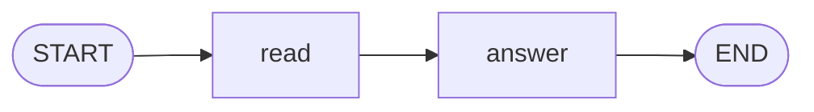

# Level 0: The idea

No code to run in this level. You learn the four words everything else is built from.

## The problem

An AI model, such as the one behind a chat assistant, does one thing: you send it text and it sends
text back. A real job is rarely one question. To answer a customer, a help desk has to:

1. read the message and work out what it is about,
2. look up the order,
3. write a reply,
4. check the reply, and write it again if it is not good,
5. ask a human before giving money back.

Something has to decide which of these happens next, carry the results from one to the other,
repeat a step, do two things at once, and wait for the human. That something is a **workflow**, and
langgraph-kt is a library for building and running one.

langgraph-kt does not contain an AI model. It is the part around the model that organizes the work.
Each piece of work is an ordinary Kotlin function, so it can call a model, a database, a web
service, or nothing at all.

> The name comes from [LangGraph](https://github.com/langchain-ai/langgraph), a Python library built
> on the same idea. You do not need to know it. langgraph-kt is an independent project.

## The map

In langgraph-kt you describe the workflow as a map, like the map of a board game:



A piece moves across the map from `START` to `END`. The map is called a **graph**, and it is made
of three things.

### State: the backpack

The **state** is everything known about the job so far. Think of it as the backpack your character
carries: it starts with what you put in, and things are added along the way.

For the help desk, the state is a ticket: who wrote, what they wrote, and later the reply.

```kotlin
data class Ticket(
    val customer: String,
    val message: String,
    val reply: String = "",
)
```

You design the state yourself. It is a plain Kotlin `data class`.

### Node: a place where one thing happens

A **node** is a stop on the map where one piece of work is done: "read the message", "write a
reply". A node receives the backpack, does its work, and hands back the backpack with something
added.

In code, a node is a function from state to state:

```kotlin
{ ticket -> ticket.copy(reply = "Hi ${ticket.customer}!") }
```

### Edge: a path between two places

An **edge** is an arrow from one node to another. It says what happens next. Some arrows are fixed
("after `read`, always go to `answer`"). Others choose ("if it is about a refund, go to `refund`,
otherwise go to `answer`").

Two places are on every map and are not nodes you write: **`START`**, where a run begins, and
**`END`**, where it finishes.

## How a run goes

Running a graph is like playing a turn-based game. The library's engine plays it for you:

1. You hand it the starting state, for example a ticket with the customer's message.
2. It follows the arrows out of `START` and runs the nodes they point to.
3. Each node returns an updated state.
4. It follows the arrows out of those nodes to find what runs next.
5. It repeats 3 and 4 until every path has reached `END`, and gives you the final state.

Each round of "run the nodes, follow the arrows" is called a **step**.

That is the whole idea. The rest of the tutorial adds one ability per level: choosing a path, going
round in a loop, running nodes at the same time, watching the run, and pausing it.

## Level complete

You know the four words:

| Word | Meaning | In the game |
|---|---|---|
| State | The data of one job, passed from node to node | The backpack |
| Node | A function that does one piece of work and returns the new state | A place on the map |
| Edge | What runs after a node | A path between two places |
| Graph | All nodes and edges together | The map |

[All levels](README.md) · Next: [Level 1, your first graph](01-first-graph.md)
