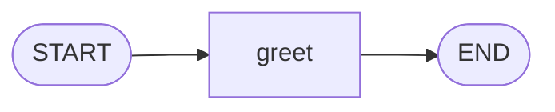

# Level 1: Your first graph

**Goal:** the help desk greets the customer.

**New moves:** `StateGraph`, `node`, `then`, `compile`, `invoke`.

## The map



One node. It is the smallest graph that does something.

## The code

[`level1/Level1.kt`](../samples/src/main/kotlin/org/langgraphkt/samples/tutorial/level1/Level1.kt)

```kotlin
import org.langgraphkt.CompiledGraph
import org.langgraphkt.END
import org.langgraphkt.START
import org.langgraphkt.StateGraph

data class Ticket(
    val customer: String,
    val message: String,
    val reply: String = "",
)

fun helpDesk(): CompiledGraph<Ticket> =
    StateGraph<Ticket> {
        val greet = node("greet") { ticket -> ticket.copy(reply = "Hi ${ticket.customer}, thanks for writing to Pixel Pizza!") }

        START then greet then END
    }.compile()

suspend fun main() {
    val result = helpDesk().invoke(Ticket(customer = "Ana", message = "Where is my pizza?"))
    println(result.state.reply)
}
```

## Run it

```bash
./gradlew :samples:runLevel1
```

```
Hi Ana, thanks for writing to Pixel Pizza!
```

## What happened

Read the program from top to bottom:

**The state.** `Ticket` is the backpack. `customer` and `message` are filled in at the start.
`reply` starts empty (`= ""`) because a node will fill it in.

**`StateGraph<Ticket> { ... }`** starts a new map whose state is a `Ticket`. Everything between the
braces describes the map.

**`node("greet") { ticket -> ... }`** adds a node. It has a name, `"greet"`, and a function. The
function receives the current ticket and returns a new one. `ticket.copy(reply = ...)` means "the
same ticket, but with this reply". `node` gives back a handle, stored in `greet`, that you use to
draw arrows.

**`START then greet then END`** draws two arrows: from `START` to `greet`, and from `greet` to
`END`. Read it aloud and it says what it does.

**`.compile()`** checks the map and turns it into something you can run, a `CompiledGraph`. If the
map has a mistake, such as an arrow to a node that does not exist, `compile()` tells you here,
before anything runs. You compile once and can then run the graph as often as you like.

**`invoke(...)`** plays one run. You give it the starting state and it returns the result when the
run reaches `END`. `result.state` is the final ticket.

**`suspend`.** `invoke` is a `suspend` function. That is Kotlin's way of marking a function that may
wait (for a model, for a network) without blocking the program. You can only call it from another
`suspend` function, which is why `main` is marked `suspend` too. Node functions are `suspend` as
well, so a node may wait for as long as it needs.

## Your turn

1. Change the greeting so it repeats the customer's message, for example
   `Hi Ana, you asked: Where is my pizza?`. The message is in `ticket.message`.
2. Run the graph for two customers. Call `helpDesk()` once, keep the graph in a `val`, and call
   `invoke` twice with different tickets.

## Level complete

You can now:

- describe a state as a `data class`,
- add a node and connect it to `START` and `END`,
- compile a graph and run it with `invoke`.

[Back to level 0](00-the-idea.md) · [All levels](README.md) · Next: [Level 2, a line of nodes](02-a-line-of-nodes.md)
