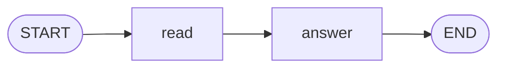

# Level 2: A line of nodes

**Goal:** the help desk first works out what the message is about, then writes a reply that uses it.

**New moves:** several nodes in a row, and state that grows as it travels.

## The map



## The code

[`level2/Level2.kt`](../samples/src/main/kotlin/org/langgraphkt/samples/tutorial/level2/Level2.kt)
(imports are left out from here on; the file has them)

```kotlin
data class Ticket(
    val customer: String,
    val message: String,
    val topic: String = "",
    val reply: String = "",
)

fun topicOf(message: String): String =
    when {
        "refund" in message.lowercase() -> "refund"
        "where" in message.lowercase() -> "delivery"
        else -> "other"
    }

fun helpDesk(): CompiledGraph<Ticket> =
    StateGraph<Ticket> {
        val read = node("read") { ticket -> ticket.copy(topic = topicOf(ticket.message)) }
        val answer = node("answer") { ticket -> ticket.copy(reply = "Hi ${ticket.customer}, we got your ${ticket.topic} question.") }

        START then read then answer then END
    }.compile()

suspend fun main() {
    val result = helpDesk().invoke(Ticket(customer = "Ana", message = "Where is my pizza?"))
    println("topic: ${result.state.topic}")
    println("reply: ${result.state.reply}")
}
```

`topicOf` stands in for an AI model. A real help desk would ask a model "what is this message
about?". Here it looks for a keyword, which is enough to learn how graphs work. Level 8 shows a
node that asks a model.

## Run it

```bash
./gradlew :samples:runLevel2
```

```
topic: delivery
reply: Hi Ana, we got your delivery question.
```

## What happened

The ticket travelled along the arrows and each node added one thing:

| Moment | `topic` | `reply` |
|---|---|---|
| You call `invoke` | (empty) | (empty) |
| After `read` | `delivery` | (empty) |
| After `answer` | `delivery` | `Hi Ana, we got your delivery question.` |

`answer` could use `ticket.topic` because `read` ran before it and put the topic in the backpack.
That is how nodes work together: they never call each other. Each one reads what it needs from the
state and writes its result into the state.

### Why `copy`?

A node does not change the ticket it receives. It returns a new ticket made with `copy`, which
means "the same, except for these fields". The state is never edited in place, and there is a
reason for this rule:

- When two nodes run at the same time (level 5), each gets its own untouched ticket, so they cannot
  spoil each other's work.
- The engine can save the state after every step (level 7) and be sure nobody changes it afterwards.

So declare every field of your state with `val`, and use read-only collections such as `List`.

### Order

The order in which you write the `node(...)` lines does not matter. The arrows decide what runs
when.

## Your turn

Add a third node, `sign`, that runs after `answer` and adds a signature to the reply. You need two
changes: a new node, and one more stop in the line of arrows.

<details>
<summary>Show a solution</summary>

```kotlin
val sign = node("sign") { ticket -> ticket.copy(reply = ticket.reply + " The Pixel Pizza team") }

START then read then answer then sign then END
```

</details>

## Level complete

You can now:

- put several nodes in a row,
- let a later node use what an earlier node found out,
- explain why nodes return a copy instead of changing the state.

[Back to level 1](01-first-graph.md) · [All levels](README.md) · Next: [Level 3, choices](03-choices.md)
