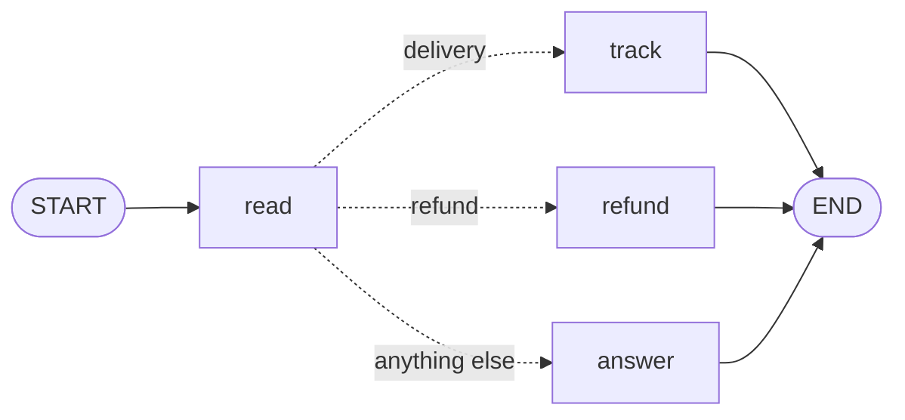

# Level 3: Choices

**Goal:** the help desk handles a delivery question, a refund request and everything else in three
different ways.

**New moves:** `conditionalEdge`, `targets`.

## The map



After `read` the path splits. Only one of the three dotted arrows is taken in a run.

## The code

[`level3/Level3.kt`](../samples/src/main/kotlin/org/langgraphkt/samples/tutorial/level3/Level3.kt)
(`Ticket` and `topicOf` are the same as in level 2)

```kotlin
fun helpDesk(): CompiledGraph<Ticket> =
    StateGraph<Ticket> {
        val read = node("read") { ticket -> ticket.copy(topic = topicOf(ticket.message)) }
        val track = node("track") { ticket -> ticket.copy(reply = "Your pizza left the oven and is on its way.") }
        val refund = node("refund") { ticket -> ticket.copy(reply = "We are sorry. Your money is on its way back.") }
        val answer = node("answer") { ticket -> ticket.copy(reply = "Thanks for your message. A human will reply soon.") }

        START then read
        conditionalEdge(read, targets = setOf(track.name, refund.name, answer.name)) { ticket ->
            when (ticket.topic) {
                "delivery" -> track.name
                "refund" -> refund.name
                else -> answer.name
            }
        }
        track then END
        refund then END
        answer then END
    }.compile()

suspend fun main() {
    val graph = helpDesk()
    for (message in listOf("Where is my pizza?", "I want a refund", "Do you sell salad?")) {
        val result = graph.invoke(Ticket(customer = "Ana", message = message))
        println("$message -> ${result.state.reply}")
    }
}
```

## Run it

```bash
./gradlew :samples:runLevel3
```

```
Where is my pizza? -> Your pizza left the oven and is on its way.
I want a refund -> We are sorry. Your money is on its way back.
Do you sell salad? -> Thanks for your message. A human will reply soon.
```

## What happened

`then` draws an arrow that is always followed. `conditionalEdge` draws an arrow that decides. It
has three parts:

```kotlin
conditionalEdge(read, targets = setOf(track.name, refund.name, answer.name)) { ticket -> ... }
//              ^     ^                                                      ^
//              |     the places this arrow may lead to                      the function that picks one
//              the node the arrow starts from
```

- **The function** runs after `read` has finished. It receives the state and returns the **name**
  of the node to run next. This function is often called a *router*. `track.name` is simply the
  text `"track"`; using the handle saves you from typing mistakes. To finish the run, a router
  returns `END`.
- **`targets`** lists every name the router may return. You could leave it out, but declare it
  whenever you can: `compile()` then checks that all those nodes exist and that every node can be
  reached, and during a run the library stops with a clear error if the router returns something
  that is not on the list.

Two rules:

- The router only decides. It does not change the state. Work that changes the state belongs in a
  node, which is why `read` stores the topic and the router just looks at it.
- A node has either ordinary arrows or one conditional edge, not both.

## Your turn

1. Add a fourth path: when the message contains "menu", go to a new `menu` node that replies with
   today's pizzas. You have to touch four places: `topicOf`, a new node, the router and `targets`.
2. Now remove `menu.name` from `targets` and run it again. `compile()` refuses the graph with
   `Node 'menu' is not reachable from START`, because as far as the map says, no arrow leads there.
   The mistake is found before a single customer is answered.

## Level complete

You can now:

- send a run down different paths depending on the state,
- say what a router is and why it returns a name,
- explain what `targets` protects you from.

[Back to level 2](02-a-line-of-nodes.md) · [All levels](README.md) · Next: [Level 4, loops](04-loops.md)
