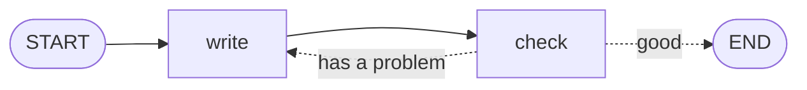

# Level 4: Loops

**Goal:** the help desk checks its own reply and rewrites it until it is good enough to send.

**New moves:** an arrow that goes back, and the step limit `maxIterations`.

This is the move that makes a workflow feel intelligent. AI models rarely get everything right the
first time, so "write, check, try again" is one of the most common shapes you will build.

## The map



## The code

[`level4/Level4.kt`](../samples/src/main/kotlin/org/langgraphkt/samples/tutorial/level4/Level4.kt)

```kotlin
data class Ticket(
    val customer: String,
    val message: String,
    val reply: String = "",
    val attempts: Int = 0,
    val problem: String = "",
)

const val MAX_ATTEMPTS = 5

/** Pretends to be an AI writer whose reply gets better with every attempt. */
fun writeReply(ticket: Ticket): String =
    when (ticket.attempts) {
        0 -> "Your pizza is late."
        1 -> "Sorry, your pizza is late."
        else -> "Sorry ${ticket.customer}, your pizza is late. It arrives in 10 minutes."
    }

/** Returns what is wrong with the reply, or an empty string when it is good enough to send. */
fun problemWith(ticket: Ticket): String =
    when {
        "sorry" !in ticket.reply.lowercase() -> "say sorry"
        ticket.customer !in ticket.reply -> "use the customer's name"
        else -> ""
    }

fun helpDesk(): CompiledGraph<Ticket> =
    StateGraph<Ticket> {
        val write = node("write") { ticket -> ticket.copy(reply = writeReply(ticket), attempts = ticket.attempts + 1) }
        val check = node("check") { ticket -> ticket.copy(problem = problemWith(ticket)) }

        START then write then check
        conditionalEdge(check, targets = setOf(write, NodeRef.END)) { ticket ->
            if (ticket.problem.isEmpty() || ticket.attempts >= MAX_ATTEMPTS) NodeRef.END else write
        }
    }.compile()

suspend fun main() {
    val result = helpDesk().invoke(Ticket(customer = "Ana", message = "My pizza is late!"))
    println("attempts: ${result.state.attempts}")
    println("reply: ${result.state.reply}")
}
```

## Run it

```bash
./gradlew :samples:runLevel4
```

```
attempts: 3
reply: Sorry Ana, your pizza is late. It arrives in 10 minutes.
```

## What happened

There is no special "loop" command. A loop is a conditional edge whose router may return a node
that has already run. Here is the run, step by step:

| Step | Node | What it did | `problem` afterwards |
|---|---|---|---|
| 1 | `write` | Attempt 1: `Your pizza is late.` | |
| 2 | `check` | No apology | `say sorry` |
| 3 | `write` | Attempt 2: `Sorry, your pizza is late.` | `say sorry` |
| 4 | `check` | No name | `use the customer's name` |
| 5 | `write` | Attempt 3: `Sorry Ana, your pizza is late. ...` | `use the customer's name` |
| 6 | `check` | Nothing wrong | (empty) |

After step 6 the router sees an empty `problem` and returns `NodeRef.END`. That is `END` as a
handle: a router returns handles, and plain `END` is a text, so the two cannot be mixed.

Notice what the state is doing: `attempts` and `problem` are the memory of the loop. A node cannot
remember anything by itself, so whatever one round needs to know about the previous round goes in
the state. With a real model, `write` would put `ticket.problem` into its request ("write the reply
again, and this time say sorry").

### Always give a loop a way out

A loop that never reaches `END` would run forever, and with a real model every round costs time and
money. There are two safety nets, and you should use both:

1. **Your own limit, in the router.** `ticket.attempts >= MAX_ATTEMPTS` ends the loop after five
   attempts even if the reply is still not perfect. You decide what happens then.
2. **The library's step limit.** A run stops with `MaxIterationsExceededException` after 25 steps.
   It exists for the case where you forgot the first one. You can change the limit for a run:

```kotlin
graph.invoke(ticket, GraphConfig(maxIterations = 50))
```

## Your turn

1. Set `MAX_ATTEMPTS` to 2 and run the level. The output becomes `attempts: 2` and
   `reply: Sorry, your pizza is late.`: the loop gave up and sent a reply that still has a problem.
2. Giving up silently is not a good ending. Add a node `handOver` that replies "A colleague will
   contact you", and make the router go there instead of to `END` when the attempts run out.
   Remember to add it to `targets`.

## Level complete

You can now:

- build a loop with a conditional edge that points back,
- keep the loop's memory in the state,
- protect a loop with your own limit and know about the library's.

[Back to level 3](03-choices.md) · [All levels](README.md) · Next: [Level 5, doing two things at once](05-parallel.md)
