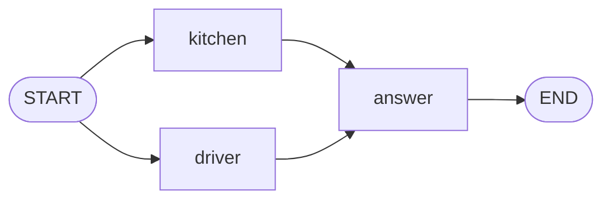

# Level 4: Two things at once

**Goal:** to answer "Where is my pizza?", the help desk asks the kitchen and the driver at the same
time instead of one after the other. And you watch it happen, instead of waiting for the result.

**New moves:** fan-out (several arrows from one place), a node with a `work` and an `update`,
`stream`, `GraphEvent`.

## The map



Two arrows leave `START`. Both are ordinary arrows, so both are followed.

## The code

[`level4/Level4.kt`](../samples/src/main/kotlin/dev/deeptelar/telar/samples/tutorial/level4/Level4.kt)

```kotlin
data class Ticket(
    val customer: String,
    val message: String,
    val facts: List<String> = emptyList(),
    val reply: String = "",
)

/** A slow call to the kitchen. `delay` stands in for the time a real call to another system takes. */
suspend fun askKitchen(millis: Long): String {
    delay(millis)
    return "your pizza left the oven"
}

/** A slow call to the driver. */
suspend fun askDriver(millis: Long): String {
    delay(millis)
    return "the driver is 5 minutes away"
}

fun helpDesk(lookupMillis: Long = 1_000): CompiledGraph<Ticket> =
    StateGraph<Ticket> {
        // `work` asks and returns what it found. The block after it writes that fact into the ticket.
        val kitchen = node("kitchen", work = { askKitchen(lookupMillis) }) { ticket, fact -> ticket.copy(facts = ticket.facts + fact) }
        val driver = node("driver", work = { askDriver(lookupMillis) }) { ticket, fact -> ticket.copy(facts = ticket.facts + fact) }
        val answer = node("answer") { ticket -> ticket.copy(reply = "Hi ${ticket.customer}, ${ticket.facts.joinToString(" and ")}.") }

        START then kitchen then answer
        START then driver then answer
        answer then END
    }.compile()

suspend fun main() {
    val (result, time) = measureTimedValue { helpDesk().invoke(Ticket(customer = "Ana", message = "Where is my pizza?")) }
    println(result.state.reply)
    println("Two lookups of one second each took ${time.inWholeMilliseconds} ms.")
}
```

`delay(millis)` makes each lookup wait one second, the way a real call to another system would.
The file's `main` goes on after these lines; [Watching it happen](#watching-it-happen) shows the
rest.

## Run it

```bash
./gradlew :samples:runLevel4
```

```
Hi Ana, your pizza left the oven and the driver is 5 minutes away.
Two lookups of one second each took 1009 ms.

step 1: kitchen started
step 1: driver started
step 1: kitchen finished
step 1: driver finished
step 1 done, facts so far: 2
step 2: answer started
step 2: answer finished
step 2 done, facts so far: 2
finished: Hi Ana, your pizza left the oven and the driver is 5 minutes away.
```

The number of milliseconds varies a little. What matters is that it is about one second, not two.
The lines that start with `step` are the second half of the level.

## What happened

When several ordinary arrows leave the same place, the engine runs all the nodes they point to **in
the same step, at the same time**. This is called *fan-out*.

That raises a question that did not exist before. Until now a node returned the whole ticket. If
`kitchen` and `driver` both did that, there would be two tickets after the step, each with one
fact, and the run can only continue with one.

So these two nodes are written in two parts:

```kotlin
val kitchen = node("kitchen", work = { askKitchen(lookupMillis) }) { ticket, fact ->
    ticket.copy(facts = ticket.facts + fact)
}
```

- **`work`** is the slow part. It receives the ticket and returns a result, here the fact as a
  text. The `work` of all the nodes of a step runs at the same time.
- **The block after it** is the node's `update`. It receives the ticket and the result, and returns
  the ticket with the result written into it. Updates do not run at the same time: when all the
  work is done, the engine applies them one after the other, each to the ticket that the previous
  one produced.

So `kitchen` adds its fact to the ticket, and `driver` adds its fact to the ticket that already has
the kitchen's. Nothing is lost, and there are never two tickets to choose from.

Three things to know:

- **The order is the order of the `node(...)` lines**, not the order in which the work finishes.
  `kitchen` was added first, so its fact comes first, even if the driver answers sooner. If two
  nodes write the same field, the one added later wins.
- **Slow calls belong in `work`.** The update only builds the new ticket. The engine may call it
  more than once, so it must not send, save or pay anything.
- **A node that returns the whole ticket still works here.** One of them can share a step with
  nodes like `kitchen`. Two of them cannot: `compile()` refuses that graph, and you will see its
  message in level 7.

And `answer`? Two arrows lead to it, but they arrive in the same step, so it runs once, with the
ticket that has both facts.

## Watching it happen

A run with real AI models can take many seconds. A person looking at an app wants to see "asking
the kitchen...", not a frozen screen. The second half of `main` runs the same graph again and
changes only how it is run:

```kotlin
fun describe(event: GraphEvent<Ticket>): String =
    when (event) {
        is GraphEvent.NodeStarted -> "step ${event.step}: ${event.node} started"
        is GraphEvent.NodeProgress -> "step ${event.step}: ${event.node} reports ${event.value}"
        is GraphEvent.NodeCompleted -> "step ${event.step}: ${event.node} finished"
        is GraphEvent.StepCompleted -> "step ${event.step} done, facts so far: ${event.state.facts.size}"
        is GraphEvent.Completed -> "finished: ${event.state.reply}"
        is GraphEvent.Interrupted -> "paused before ${event.nextNodes}"
    }

helpDesk().stream(Ticket(customer = "Ana", message = "Where is my pizza?")).collect { event ->
    println(describe(event))
}
```

`invoke` plays the whole run and tells you the result. `stream` plays the same run and tells you
about everything on the way. It returns a Kotlin `Flow`, which is a sequence of values that arrive
over time. `collect { ... }` runs your code for each one, so the lines appear one by one as things
happen.

The values are **events**. There are six kinds:

| Event | When | What it carries |
|---|---|---|
| `NodeStarted` | A node is about to run | `step`, `node`, the state the node receives |
| `NodeProgress` | A running node has something to show | `step`, `node`, the `value` the node reported |
| `NodeCompleted` | A node finished | `step`, `node`, the state the node returned |
| `StepCompleted` | All nodes of a step finished | `step`, `nodes`, the state after the step, with the results of all its nodes |
| `Completed` | The run reached `END` | The final state. Always the last event. |
| `Interrupted` | The run paused | The state and the nodes that are next. Level 5 explains pausing. |

Every stream ends with exactly one `Completed` or `Interrupted`.

In the output you can see the fan-out at work: both lookups start before either finishes, and they
share step 1. `kitchen finished` and `driver finished` may swap places, because the two nodes
finish at almost the same moment.

Because `when` covers all six kinds, the Kotlin compiler would complain if you forgot one. That is
why `describe` handles `Interrupted` and `NodeProgress` even though this graph never pauses and its
nodes report nothing.

Three more things to know:

- **A node can report progress itself.** It calls `reportProgress(value)` while it works, and the
  value arrives in the stream as a `NodeProgress` before the node finishes. This is how an AI
  model's answer appears word by word in level 6. With `invoke`, nobody watches, and
  `reportProgress` does nothing.

  ```kotlin
  val kitchen = node("kitchen", work = { ticket ->
      reportProgress("calling the kitchen")
      kitchenPhone.ask(ticket.customer)
  }) { ticket, fact -> ticket.copy(facts = ticket.facts + fact) }
  ```

- **`states()` gives only the state.** Often a screen just wants to show the newest state.
  `helpDesk().stream(ticket).states()` turns the events into the state after each step. It needs
  `import dev.deeptelar.telar.states`.
- **Nothing runs until you collect.** Calling `stream(...)` does not start anything. The run starts
  when you `collect`, and collecting twice runs the graph twice.

## Your turn

1. Add a third lookup, `weather`, that adds the fact "it is raining". Connect it like the other
   two. The reply now has three facts, and the time is still about one second.
2. Make `driver` wait three times as long (`askDriver(lookupMillis * 3)`). How long does the run
   take now? A step is finished when its slowest node is finished. Look at the order of the
   `finished` lines, too.
3. Change the second half of `main` to use `states()` and print the ticket's facts after every
   step. You should see two lines.

## Level complete

You can now:

- run nodes at the same time by drawing several arrows from one place,
- write a node as a `work` and an `update`, so that it can run next to other nodes,
- say in which order the results of parallel nodes are written into the state,
- follow a run live with `stream` and name the six events.

[Back to level 3](03-loops.md) · [All levels](README.md) · Next: [Level 5, save points](05-save-points.md)
