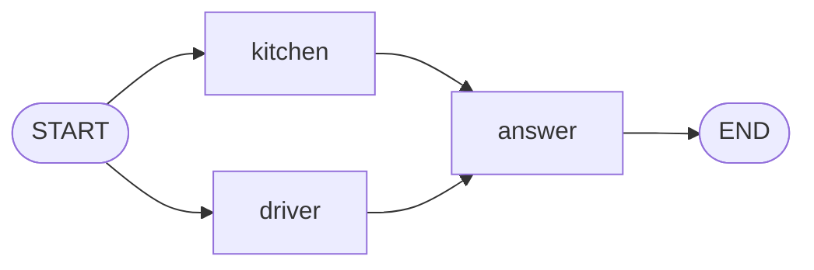

# Level 5: Doing two things at once

**Goal:** to answer "Where is my pizza?", the help desk asks the kitchen and the driver at the same
time instead of one after the other.

**New moves:** fan-out (several arrows from one place), a node with a `work` and an `update`.

## The map



Two arrows leave `START`. Both are ordinary arrows, so both are followed.

## The code

[`level5/Level5.kt`](../samples/src/main/kotlin/org/langgraphkt/samples/tutorial/level5/Level5.kt)

```kotlin
data class Ticket(
    val customer: String,
    val message: String,
    val facts: List<String> = emptyList(),
    val reply: String = "",
)

/** A slow call to the kitchen. `delay` stands in for the time a real call to another system takes. */
suspend fun askKitchen(millis: Long): String {
    delay(millis)
    return "your pizza left the oven"
}

/** A slow call to the driver. */
suspend fun askDriver(millis: Long): String {
    delay(millis)
    return "the driver is 5 minutes away"
}

fun helpDesk(lookupMillis: Long = 1_000): CompiledGraph<Ticket> =
    StateGraph<Ticket> {
        // `work` asks and returns what it found. The block after it writes that fact into the ticket.
        val kitchen = node("kitchen", work = { askKitchen(lookupMillis) }) { ticket, fact -> ticket.copy(facts = ticket.facts + fact) }
        val driver = node("driver", work = { askDriver(lookupMillis) }) { ticket, fact -> ticket.copy(facts = ticket.facts + fact) }
        val answer = node("answer") { ticket -> ticket.copy(reply = "Hi ${ticket.customer}, ${ticket.facts.joinToString(" and ")}.") }

        START then kitchen then answer
        START then driver then answer
        answer then END
    }.compile()

suspend fun main() {
    val (result, time) = measureTimedValue { helpDesk().invoke(Ticket(customer = "Ana", message = "Where is my pizza?")) }
    println(result.state.reply)
    println("Two lookups of one second each took ${time.inWholeMilliseconds} ms.")
}
```

`delay(millis)` makes each lookup wait one second, the way a real call to another system would.

## Run it

```bash
./gradlew :samples:runLevel5
```

```
Hi Ana, your pizza left the oven and the driver is 5 minutes away.
Two lookups of one second each took 1009 ms.
```

The number of milliseconds varies a little. What matters is that it is about one second, not two.

## What happened

When several ordinary arrows leave the same place, the engine runs all the nodes they point to **in
the same step, at the same time**. This is called *fan-out*.

That raises a question that did not exist before. Until now a node returned the whole ticket. If
`kitchen` and `driver` both did that, there would be two tickets after the step, each with one
fact, and the run can only continue with one.

So these two nodes are written in two parts:

```kotlin
val kitchen = node("kitchen", work = { askKitchen(lookupMillis) }) { ticket, fact ->
    ticket.copy(facts = ticket.facts + fact)
}
```

- **`work`** is the slow part. It receives the ticket and returns a result, here the fact as a
  text. The `work` of all the nodes of a step runs at the same time.
- **The block after it** is the node's `update`. It receives the ticket and the result, and returns
  the ticket with the result written into it. Updates do not run at the same time: when all the
  work is done, the engine applies them one after the other, each to the ticket that the previous
  one produced.

So `kitchen` adds its fact to the ticket, and `driver` adds its fact to the ticket that already has
the kitchen's. Nothing is lost, and there are never two tickets to choose from.

Three things to know:

- **The order is the order of the `node(...)` lines**, not the order in which the work finishes.
  `kitchen` was added first, so its fact comes first, even if the driver answers sooner. If two
  nodes write the same field, the one added later wins.
- **Slow calls belong in `work`.** The update only builds the new ticket. The engine may call it
  more than once, so it must not send, save or pay anything.
- **A node that returns the whole ticket still works here.** One of them can share a step with
  nodes like `kitchen`. Two of them cannot: `compile()` refuses that graph, and you will see its
  message in level 10.

And `answer`? Two arrows lead to it, but they arrive in the same step, so it runs once, with the
ticket that has both facts.

## Your turn

1. Add a third lookup, `weather`, that adds the fact "it is raining". Connect it like the other
   two. The reply now has three facts, and the time is still about one second.
2. Make `driver` wait three times as long (`askDriver(lookupMillis * 3)`). How long does the run
   take now? A step is finished when its slowest node is finished.

## Level complete

You can now:

- run nodes at the same time by drawing several arrows from one place,
- write a node as a `work` and an `update`, so that it can run next to other nodes,
- say in which order the results of parallel nodes are written into the state.

[Back to level 4](04-loops.md) · [All levels](README.md) · Next: [Level 6, watching a run](06-watching-a-run.md)
