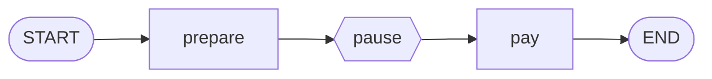

# Level 5: Save points

**Goal:** before the help desk gives money back, it stops and waits for a human to approve. The
human may answer a minute or a day later.

**New moves:** `GraphConfig`, checkpointer, `threadId`, `interruptBefore`, `resume`, `lastResult`.

Games have save points so you can stop playing and continue later from the same place. A graph can
do the same. This is what makes "a human approves it first" possible, and it is usually called
*human-in-the-loop*.

## The map



The pause is not a node. It is a place where you tell the run to stop and save.

## The code

[`level5/Level5.kt`](../samples/src/main/kotlin/dev/deeptelar/telar/samples/tutorial/level5/Level5.kt)

```kotlin
data class Ticket(
    val customer: String,
    val message: String,
    val refund: Int = 0,
    val approved: Boolean = false,
    val reply: String = "",
)

const val PAY = "pay"

fun helpDesk(): CompiledGraph<Ticket> =
    StateGraph<Ticket> {
        val prepare = node("prepare") { ticket -> ticket.copy(refund = 12) }
        val pay =
            node(PAY) { ticket ->
                if (ticket.approved) {
                    ticket.copy(reply = "Sorry ${ticket.customer}! We sent you ${ticket.refund} euros.")
                } else {
                    ticket.copy(reply = "Sorry ${ticket.customer}, we cannot refund this order.")
                }
            }

        START then prepare then pay then END
    }.compile()

suspend fun main() {
    val graph = helpDesk()
    val config =
        GraphConfig(
            threadId = "ticket-42",
            checkpointer = MemoryCheckpointer<Ticket>(),
            interruptBefore = setOf(PAY),
        )

    when (val paused = graph.invoke(Ticket(customer = "Ana", message = "My pizza arrived cold. I want a refund."), config)) {
        is GraphResult.Interrupted -> println("Paused before ${paused.nextNodes}. Refund: ${paused.state.refund} euros.")
        is GraphResult.Completed -> error("Expected the run to pause before paying")
    }

    print("Approve the refund? [y/N] ")
    val approved = readlnOrNull()?.trim().equals("y", ignoreCase = true)

    val finished = graph.resume(config) { ticket -> ticket.copy(approved = approved) }
    println(finished.state.reply)
}
```

## Run it

This level asks you a question, so run it with plain output:

```bash
./gradlew :samples:runLevel5 --console=plain -q
```

```
Paused before [pay]. Refund: 12 euros.
Approve the refund? [y/N] y
Sorry Ana! We sent you 12 euros.
```

Type `y` and press Enter. Run it again and answer `n` to see the other ending.

## What happened

The graph itself is a plain line of two nodes. Everything new is in the **`GraphConfig`**, the
settings for a run:

| Setting | Meaning | In the game |
|---|---|---|
| `checkpointer` | Where saves are stored. A save is called a *checkpoint*: the state, plus which nodes come next. | The memory card |
| `threadId` | The name of this one job. Each ticket gets its own, so their saves do not mix. | The save slot |
| `interruptBefore` | Names of nodes to stop in front of. | "Save and quit" at this door |

Then the run happens in two parts.

**Part 1: `invoke`.** The run does `prepare`, sees that `pay` is next and is on the
`interruptBefore` list, saves, and stops. `invoke` returns a `GraphResult`, which is one of two
things:

- `GraphResult.Completed`: the run reached `END`.
- `GraphResult.Interrupted`: the run paused. `nextNodes` says what is waiting to run.

Both carry the `state`. In earlier levels the result was always `Completed`, so you could go
straight to `result.state`. Now you check which one you got, with `when`.

**In between.** Nothing is running. Your program is free to show the refund to a manager and wait
for as long as it takes.

**Part 2: `resume`.** It loads the save for this `threadId` and continues from where the run
stopped. The function you pass edits the saved state first. That is how the human's decision gets
into the run: `ticket.copy(approved = approved)`. Then `pay` runs with the updated ticket.

### Three things to remember

- **`invoke` is "new game", `resume` is "continue".** `invoke` always starts from `START` and
  replaces the save in that slot.
- **A save is written after every step**, not only at a pause. Level 7 uses this to retry after a
  failure.
- **`interruptAfter`** also exists. It stops after a node has run instead of before.

### Where does a thread stand?

Imagine the manager closes the app and opens it the next morning. Which tickets are waiting?
`lastResult` reads the save without running anything:

```kotlin
when (val result = graph.lastResult(config)) {
    is GraphResult.Interrupted -> println("Waiting before ${result.nextNodes}")
    is GraphResult.Completed -> println("Done: ${result.state.reply}")
    null -> println("This ticket has never run")
}
```

### A save that survives closing the program

`MemoryCheckpointer` keeps saves in memory, so they are gone when the program ends. That is fine
for learning and for tests. `FileCheckpointer` writes them to files, so a run can be resumed after
a restart, even by a different program:

```kotlin
@Serializable
data class Ticket(...)

val checkpointer = FileCheckpointer(Path("checkpoints"), KotlinxStateSerializer<Ticket>())
```

`@Serializable` tells Kotlin how to turn the ticket into text for the file. The
[HumanInTheLoop sample](../samples/src/main/kotlin/dev/deeptelar/telar/samples/HumanInTheLoop.kt) is a
complete program that does this.

A web app has no files. There, `LocalStorageCheckpointer` keeps the saves in the browser, so a
paused run is still waiting after the page is reloaded. To keep saves somewhere else, such as a
database, you implement `Checkpointer`, which has three functions: `save`, `load` and `delete`. The
[README](../README.md#human-in-the-loop) shows both.

## Your turn

1. After `invoke`, print `graph.lastResult(config)`. Then print it again after `resume`. You see
   the save change from `Interrupted` to `Completed`.
2. Call `resume` a second time at the end of `main`. It fails with `GraphAlreadyCompletedException`:
   a finished game has nothing to continue.
3. Let the manager change the amount: in the `resume` function, also set `refund = 5`.

## Level complete

You can now:

- give a run a save slot and a place to store saves,
- pause a run before a node and continue it with a human's decision,
- tell `invoke`, `resume` and `lastResult` apart.

[Back to level 4](04-two-things-at-once.md) · [All levels](README.md) · Next: [Level 6, the agent](06-the-agent.md)
