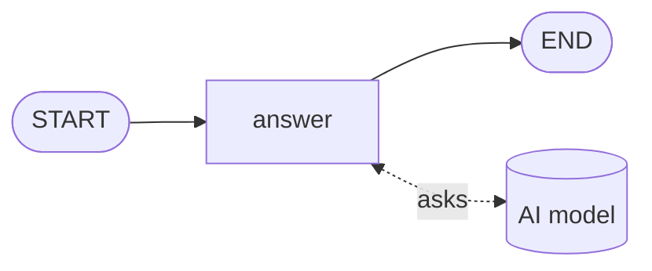

# Level 8: A real AI model

**Goal:** an AI model writes the reply.

**New moves:** `chatNode`, and the idea that a model is just something a node calls.

Until now, small Kotlin functions pretended to be the AI. You have built choices, loops, parallel
work and pauses without a model, which shows what the library really is: it organizes the work. A
model is one of the things a node can use to do its work.

## The map



The model is not on the map. It is outside, and the `answer` node talks to it.

## The code

[`level8/Level8.kt`](../samples/src/main/kotlin/org/langgraphkt/samples/tutorial/level8/Level8.kt)

```kotlin
data class Ticket(
    val customer: String,
    val message: String,
    val reply: String = "",
)

fun helpDesk(model: ChatModel): CompiledGraph<Ticket> =
    StateGraph<Ticket> {
        val answer =
            node(
                "answer",
                chatNode(
                    model = model,
                    prompt = { ticket ->
                        "You work at the help desk of Pixel Pizza. Reply in one friendly sentence " +
                            "to ${ticket.customer}, who wrote: ${ticket.message}"
                    },
                    update = { ticket, reply -> ticket.copy(reply = reply) },
                ),
            )

        START then answer then END
    }.compile()

/** Stands in for a real model, so the level runs without an account or an API key. */
class PretendModel : ChatModel {
    override fun doChat(chatRequest: ChatRequest): ChatResponse =
        ChatResponse.builder().aiMessage(AiMessage.from("Thanks for your patience! Your pizza is on its way.")).build()
}

suspend fun main() {
    val result = helpDesk(PretendModel()).invoke(Ticket(customer = "Ana", message = "Where is my pizza?"))
    println(result.state.reply)
}
```

## Run it

```bash
./gradlew :samples:runLevel8
```

```
Thanks for your patience! Your pizza is on its way.
```

(Lines starting with `SLF4J` may appear first. They are a notice from a logging library and can be
ignored.)

## What happened

[LangChain4j](https://docs.langchain4j.dev) is a Java library that can talk to most AI models
through one common type, `ChatModel`. The module `langgraph-kt-langchain4j` connects it to your
graph with `chatNode`, which builds a node out of three parts:

| Part | What you give it | Here |
|---|---|---|
| `model` | Which model to ask | Whatever was passed to `helpDesk` |
| `prompt` | How to turn the state into the text sent to the model | A sentence containing the customer's name and message |
| `update` | How to put the model's answer into the state | Store it in `reply` |

The text you send to a model is called a *prompt*.

The graph takes the model as a parameter (`helpDesk(model: ChatModel)`) instead of creating it.
This level passes a `PretendModel` that always gives the same answer, so it runs anywhere and costs
nothing. Your tests should do the same.

### Plugging in a real model

To use a real model, add the LangChain4j module for your provider to your project and build its
`ChatModel`. For example, for Claude, with the dependency `dev.langchain4j:langchain4j-anthropic`:

```kotlin
val model = AnthropicChatModel.builder()
    .apiKey(System.getenv("ANTHROPIC_API_KEY"))
    .modelName("claude-opus-5-5")
    .build()

val result = helpDesk(model).invoke(Ticket(customer = "Ana", message = "Where is my pizza?"))
```

Nothing else changes. LangChain4j has modules for other providers too, and for models that run on
your own computer through Ollama. This snippet is not part of the runnable level, because it needs
an account and a key. Keep the key out of your source code; read it from an environment variable as
shown.

`chatNode` sends one text and gets one text back. For a conversation with several messages, use
`chatMessagesNode`; the
[ChatAgent sample](../samples/src/main/kotlin/org/langgraphkt/samples/ChatAgent.kt) shows it.

### Without LangChain4j

`chatNode` is a convenience, not a requirement. A node is a `suspend` function, so it can call
anything, with any library, on any platform:

```kotlin
val answer = node("answer") { ticket -> ticket.copy(reply = askMyModel(ticket.message)) }
```

`langgraph-kt-langchain4j` is for the JVM (Java 17 or newer, which LangChain4j requires). On the
other platforms, write the node this way with an HTTP client of your choice, or use the `ChatModel`
of `langgraph-kt-agent`, which works everywhere. The README shows it under
[AI models](../README.md#ai-models), and under [Agents with tools](../README.md#agents-with-tools)
how a model calls your functions.

### What changes when the model is real

- **It is slow.** A call takes seconds. Level 6 lets you show progress, and level 5 lets you make
  several calls at once.
- **It is not always right.** That is what the loop of level 4 is for, and the pause of level 7.
- **It can fail.** The network drops, the provider is busy. That is the next level.
- **It costs money.** Every call does, so limit your loops.

## Your turn

1. Change the prompt so the model is asked to reply in Spanish. With `PretendModel` the output does
   not change, which is the point of a pretend model: it ignores the prompt.
2. Make `PretendModel` less boring. `chatRequest.messages()` contains what was sent. Return a
   different answer when the text contains "refund".
3. If you have an API key, plug in a real model as shown above.

## Level complete

You can now:

- make a node that asks an AI model,
- swap a pretend model for a real one without touching the graph,
- write a model call by hand when you are not on the JVM.

[Back to level 7](07-save-points.md) · [All levels](README.md) · Next: [Level 9, game over screens](09-game-over-screens.md)
