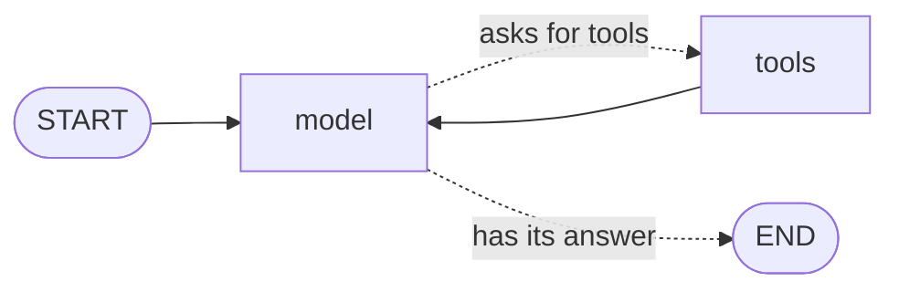

# Level 9: An agent with tools

**Goal:** the model looks up the order and the price by itself before it answers.

**New moves:** `Tool`, `toolAgent`, `AgentState`, `toolLoop`.

The model of level 8 could write a friendly sentence, but it knew nothing about Ana's order. In
level 5 the help desk did know, because *you* decided that every ticket needs a call to the kitchen
and a call to the driver.

An **agent** is a model that makes that decision itself. You give it a list of functions it may
use, and it chooses which ones to call, and how often, before it answers. Those functions are
called **tools**.

## The map



You know both moves on this map: a choice (level 3) and an arrow that goes back (level 4). You do
not have to draw it. The library has this graph ready-made.

## The code

[`level9/Level9.kt`](../samples/src/main/kotlin/org/langgraphkt/samples/tutorial/level9/Level9.kt)

```kotlin
@Serializable
data class OrderLookup(
    @Description("The customer's name, for example \"Ana\"") val customer: String,
)

@Serializable
data class MenuLookup(
    @Description("The item, for example \"cola\"") val item: String,
)

val menu = mapOf("margherita" to 9, "salad" to 6, "cola" to 2)

val orderStatus: Tool =
    Tool<OrderLookup>("order_status", "Returns where a customer's order is right now.") { lookup ->
        "The pizza for ${lookup.customer} left the oven and the driver is 5 minutes away."
    }

val menuPrice: Tool =
    Tool<MenuLookup>("menu_price", "Returns the price of one item on the menu.") { lookup ->
        val price = menu[lookup.item] ?: throw IllegalArgumentException("We do not sell ${lookup.item}.")
        "One ${lookup.item} costs $price euros."
    }

const val HELP_DESK = "You work at the help desk of Pixel Pizza. Look up orders and prices with the tools. Never guess."

fun helpDesk(model: ChatModel): CompiledGraph<AgentState> = toolAgent(model, tools = listOf(orderStatus, menuPrice), system = HELP_DESK)

suspend fun main() {
    val state = helpDesk(pretendModel).invoke(AgentState("I'm Ana. Where is my pizza, and how much is a cola?")).state
    state.messages.forEach { message -> println(describe(message)) }
}
```

The file has three more things. `pretendModel` stands in for a real model, as in level 8: it asks
for a tool when the question has a word it knows, and answers with what the tools returned.
`describe` turns one message into one line of text. `ticketDesk` is explained
[further down](#the-agent-inside-your-own-graph).

## Run it

```bash
./gradlew :samples:runLevel9
```

```
customer: I'm Ana. Where is my pizza, and how much is a cola?
model asks for: order_status {"customer":"Ana"}, menu_price {"item":"cola"}
order_status: The pizza for Ana left the oven and the driver is 5 minutes away.
menu_price: One cola costs 2 euros.
model: The pizza for Ana left the oven and the driver is 5 minutes away. One cola costs 2 euros.

Hi Ben! One salad costs 6 euros.
```

The first five lines are the conversation of the agent. The last line comes from `ticketDesk`.

## What happened

### A tool

A tool has three parts:

| Part | What you give it | Here |
|---|---|---|
| A name | How the model refers to the tool | `order_status` |
| A description | When to use it. The model reads this. | "Returns where a customer's order is right now." |
| A function | What your program does. It returns text. | A sentence about Ana's pizza |

The function takes an input class, such as `OrderLookup`. From that class the library builds a list
of the fields and their types, and sends it to the model together with the name and the
description. When the model asks for the tool, it fills in the fields, and your function receives
an `OrderLookup` that is ready to use.

`@Description` tells the model what a field is for. Write the descriptions with care: they are all
the model knows about your tool.

`@Serializable` comes from kotlinx.serialization and needs its Gradle plugin. This repository
already has it.

### The loop

Read the output again, line by line:

1. The `model` node sends the question to the model, with the list of tools. The model does not
   answer yet. It asks for two tools in one go.
2. The `tools` node runs both functions, at the same time, as in level 5. Their results are added
   to the conversation.
3. The `model` node sends the conversation again, now with the results. This time the model writes
   its answer and asks for nothing, so the run goes to `END`.

The model never runs your function. It only asks, and your program does the work. That is why you
stay in control of what a tool is allowed to do.

`toolAgent(model, tools, system)` returns a `CompiledGraph`, like every `helpDesk()` before. So
everything you have learned works with it: `invoke`, `stream`, save points and `resume`.

### The state

The state of this graph is an `AgentState`. It holds the conversation as a list of messages, and
there are three kinds:

| Message | Who wrote it | What it carries |
|---|---|---|
| `ChatMessage.User` | The customer | Text |
| `ChatMessage.Assistant` | The model | Text, or the tools it asks for (`toolCalls`) |
| `ChatMessage.ToolResult` | Your tool | The text your function returned |

`state.answer` is the text of the model's last message. To continue the conversation, add the next
question and run the agent again:

```kotlin
val next = helpDesk(pretendModel).invoke(state.withUserMessage("And a salad?")).state
```

### When a tool fails

`menuPrice` throws an exception for an item that is not on the menu. That does **not** stop the
run. The model gets the message of the exception as the result of the tool, and it can react: tell
the customer, or try again with another input.

```
customer: Do you sell tiramisu?
model asks for: menu_price {"item":"tiramisu"}
menu_price: We do not sell tiramisu.
model: We do not sell tiramisu.
```

So write the message of such an exception for the model to read.

### The agent inside your own graph

`toolAgent` is a whole graph with its own state. Often the agent is one part of a larger graph, and
the state is yours. `toolLoop` adds the same two nodes to any graph:

```kotlin
data class Ticket(
    val customer: String,
    val message: String,
    val conversation: List<ChatMessage> = emptyList(),
    val reply: String = "",
)

fun ticketDesk(model: ChatModel): CompiledGraph<Ticket> =
    StateGraph<Ticket> {
        val send = node("send") { ticket -> ticket.copy(reply = "Hi ${ticket.customer}! ${ticket.conversation.last().text}") }
        val agent =
            toolLoop(
                model = model,
                tools = listOf(orderStatus, menuPrice),
                messages = { ticket -> ticket.conversation },
                append = { ticket, new -> ticket.copy(conversation = ticket.conversation + new) },
                firstMessage = { ticket -> "I'm ${ticket.customer}. ${ticket.message}" },
                system = HELP_DESK,
                then = send,
            )

        START then agent
        send then END
    }.compile()
```

| Part | What you give it | Here |
|---|---|---|
| `messages` | Where the conversation is in your state | The field `conversation` |
| `append` | How to add new messages to it | A copy of the ticket with a longer list |
| `firstMessage` | The message that starts the conversation, built from other fields | The customer's name and message |
| `then` | Where the graph goes when the model has its answer | The `send` node. Without it, `END`. |

`toolLoop` returns the handle of its `model` node, so you connect it like any other node:
`START then agent`. That is the last line of the output:

```
Hi Ben! One salad costs 6 euros.
```

### Watching the answer arrive

A real model writes its answer word by word, and a person would rather read along than wait. Run
the agent with `stream` from level 6, and each event that carries a piece of the answer has it in
`textDelta`:

```kotlin
helpDesk(model).stream(AgentState("How much is a cola?")).collect { event ->
    event.textDelta?.let { piece -> print(piece) }
}
```

It needs `import org.langgraphkt.agent.textDelta`. For every other event `textDelta` is `null`. The
pretend model has nothing to write slowly, so its whole answer arrives as one piece.

### Plugging in a real model

The `ChatModel` of this level is not the one of level 8. Level 8 used the type of LangChain4j. This
one belongs to langgraph-kt (`org.langgraphkt.agent.ChatModel`, in the module `langgraph-kt-agent`)
and works on every platform. Both have the same name, so check the import when you mix them.

```kotlin
// Claude, on every platform. From the module langgraph-kt-anthropic; HttpClient is the Ktor client.
val model: ChatModel = AnthropicChatModel(HttpClient(), apiKey = System.getenv("ANTHROPIC_API_KEY"), model = "claude-opus-5-5")

// Or a LangChain4j model like the one of level 8, on the JVM. From the module langgraph-kt-langchain4j.
val model: ChatModel = LangChain4jChatModel(langChain4jModel)

val state = helpDesk(model).invoke(AgentState("I'm Ana. Where is my pizza?")).state
```

Nothing else changes. The
[ToolAgent sample](../samples/src/main/kotlin/org/langgraphkt/samples/ToolAgent.kt) is this help
desk with Claude: it uses the real model when the environment variable `ANTHROPIC_API_KEY` is set,
and a pretend one when it is not.

### What to know before you ship it

- **Ask a person before a tool does something that cannot be undone.** The node that runs the tools
  is named `tools`, so `interruptBefore = setOf("tools")` from level 7 pauses the run before any
  tool runs. The README shows how to read the calls that wait and how to say no, under
  [Agents with tools](../README.md#agents-with-tools).
- **Every round costs a model call.** Asking for tools and getting the results is one round, and it
  takes two steps. With the default `maxIterations` of 25, an agent can do twelve rounds.

## Your turn

1. Change the question in `main` to "Do you sell tiramisu?" and run the level. Find the line where
   the tool fails, and the line where the model reacts to it.
2. Add `"pepperoni" to 11` to the menu and ask what a pepperoni costs.
3. Write a third tool, `opening_hours`, with an input class that has a `day`, and add it to the
   list in `helpDesk`. The pretend model does not know it. Teach it: in `pretendModel`, add a call
   to your tool when the question contains "open".

## Level complete

You can now:

- write a tool that a model can call,
- build an agent with `toolAgent` and read its conversation,
- put the agent inside a graph of your own with `toolLoop`.

[Back to level 8](08-a-real-ai-model.md) · [All levels](README.md) · Next: [Level 10, game over screens](10-game-over-screens.md)
