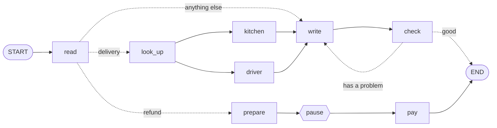

# Level 11: Your own workflow

**Goal:** put every move together, then design a graph for a problem of your own.

**New moves:** none. This is the final level: you have all the pieces.

## The complete help desk

Levels 1 to 10 each showed one move on a small graph. Here they are in one:



[`level11/Level11.kt`](../samples/src/main/kotlin/org/langgraphkt/samples/tutorial/level11/Level11.kt)
has the whole program. This is the part that draws the map:

```kotlin
START then read
conditionalEdge(read, targets = setOf(lookUp, prepare, write)) { ticket ->
    when (ticket.topic) {
        "delivery" -> lookUp
        "refund" -> prepare
        else -> write
    }
}

lookUp then kitchen then write
lookUp then driver then write
write then check
conditionalEdge(check, targets = setOf(write, NodeRef.END)) { ticket ->
    if (ticket.problem.isEmpty() || ticket.attempts >= MAX_ATTEMPTS) NodeRef.END else write
}

prepare then pay then END
```

```bash
./gradlew :samples:runLevel11
```

```
ticket-1: Hi Ana, your pizza left the oven and the driver is 5 minutes away.
ticket-2: a manager approves the refund of 12 euros
ticket-2: Sorry Ana! We sent you 12 euros.
ticket-3: Hi Ana, a colleague will reply soon.
```

Open the file and find each move:

| Move | Where | Level |
|---|---|---|
| A choice | The conditional edge after `read` | 3 |
| Two things at once | `look_up` has two arrows, to `kitchen` and `driver`, which each have a `work` and an `update` | 5 |
| A loop | `check` sends a reply without the customer's name back to `write` | 4 |
| A pause | `interruptBefore = setOf(PAY)` in `main`, then `resume` | 7 |
| A save slot per job | `threadId = "ticket-1"`, `"ticket-2"`, ... | 7 |

One detail is new. A router returns one name, so it cannot start two nodes. To split into parallel
work after a choice, route to one node and give that node two arrows. That is all `look_up` is for:
its function returns the ticket unchanged.

## A recipe for your own graph

When you start from an empty file, go through these questions in order.

**1. What is the job, from input to result?** Say it in one sentence: "Take a customer message and
produce a reply." The input and the result are the first fields of your state.

**2. What are the pieces of work?** Write them as a list of verbs: read, look up, write, check,
pay. Each one becomes a node. A good node does one thing, and you can say what it reads from the
state and what it adds. If a node needs "and" to describe, split it.

**3. What does each piece need and produce?** Everything a node produces that another node needs
becomes a field of the state. Give every field a starting value (`""`, `0`, `emptyList()`) unless
it is part of the input.

**4. What comes after what?** Draw the arrows on paper first. Start at `START` and make sure every
path reaches `END`.

**5. Where does the path depend on the result?** Each such place is a conditional edge. Let a node
write the fact into the state, and let the router only look at it.

**6. Does anything repeat?** A loop is a conditional edge that points back. Put a counter in the
state and a limit in the router.

**7. Can anything run at the same time?** Work that does not depend on each other, such as several
lookups, can share a step. Draw several arrows from one node, and give each of those nodes a
`work` and an `update`.

**8. Where must a human look first?** Anything that costs money, cannot be undone, or goes out to a
customer. Put `interruptBefore` there, give the run a checkpointer and a `threadId`, and continue
with `resume`.

**9. What can fail?** Every node that calls a model or a network. With a checkpointer you can retry
from the last save with `resume`.

Start with steps 1 to 4 and get a straight line working, as in level 2. Then add one move at a
time and run it after each. That is how this tutorial was built, and it works for real graphs too.

## A skeleton to copy

```kotlin
data class MyState(
    val input: String,
    val result: String = "",
)

fun myGraph(): CompiledGraph<MyState> =
    StateGraph<MyState> {
        val first = node("first") { state -> state.copy(result = "...") }
        val second = node("second") { state -> state.copy(result = state.result + "...") }

        START then first then second then END
    }.compile()

suspend fun main() {
    val result = myGraph().invoke(MyState(input = "..."))
    println(result.state.result)
}
```

## Testing a graph

A graph is a function from a starting state to a final state, which makes it easy to test: run it
and compare. Two habits keep the tests fast and reliable:

- **Pass in what the nodes depend on.** Level 8's `helpDesk(model)` takes the model as a parameter,
  so a test passes a pretend model that answers at once and always the same.
- **Use `runTest`** from `kotlinx-coroutines-test`. It lets a test call `suspend` functions, and it
  skips waiting: a `delay` of one second takes no real time.

```kotlin
@Test
fun `rewrites the reply until it passes the check`() =
    runTest {
        val state = helpDesk().invoke(Ticket("Ana", "My pizza is late!")).state

        assertEquals(3, state.attempts)
        assertEquals("Sorry Ana, your pizza is late. It arrives in 10 minutes.", state.reply)
    }
```

All the levels are tested this way in
[`TutorialTest.kt`](../samples/src/test/kotlin/org/langgraphkt/samples/tutorial/TutorialTest.kt).
For tests that pause and resume, use `MemoryCheckpointer`.

## Using the library in your own project

So far you worked inside this repository. In your own Gradle project, add the library as a
dependency:

```kotlin
dependencies {
    implementation("io.github.cuento3yllevo2:langgraph-kt-core:0.1.0-alpha04")

    // Only if you need them:
    implementation("io.github.cuento3yllevo2:langgraph-kt-serialization:0.1.0-alpha04")   // save @Serializable states
    implementation("io.github.cuento3yllevo2:langgraph-kt-checkpoint-file:0.1.0-alpha04") // FileCheckpointer
    implementation("io.github.cuento3yllevo2:langgraph-kt-agent:0.1.0-alpha04")           // ChatModel, tools, toolAgent
    implementation("io.github.cuento3yllevo2:langgraph-kt-anthropic:0.1.0-alpha04")       // AnthropicChatModel
    implementation("io.github.cuento3yllevo2:langgraph-kt-langchain4j:0.1.0-alpha04")     // chatNode (JVM, Java 17+)
}
```

The artifacts are on Maven Central, so your project needs the `mavenCentral()` repository. The
[README](../README.md#installation) lists the targets of each module.

## Your turn: the final quest

Pick one and build it from an empty file, using the recipe:

- **Homework helper.** Input: a question. Nodes: `explain` writes an explanation, `quiz` writes a
  practice question about it, and a `check` loop makes sure the explanation is shorter than 300
  characters.
- **Trip planner.** Input: a city. Look up the weather and three sights at the same time, then
  write a plan for the day. Pause before `book` so the traveller can approve it.
- **Something of your own.** Any job you would otherwise do in several steps by hand.

Use pretend functions first, as the tutorial does. Plug in a real model when the graph works.

## Game complete

You can build a workflow with choices, loops, parallel work, live progress, pauses and retries, and
you know where an AI model goes. From here:

- The [cheat sheet](cheat-sheet.md) has every word and every move on one page.
- The [README](../README.md#guides) has shorter, denser guides, including a reviewer who can send
  work back and a chat that continues over several turns.
- The other [samples](../samples/src/main/kotlin/org/langgraphkt/samples) are complete programs.
- The [demo app](https://github.com/Cuento3yLlevo2/langgraph-kt-demo) shows graphs running behind a
  user interface, in the browser and on the desktop.
- The [API reference](https://cuento3yllevo2.github.io/langgraph-kt/) describes every function.

[Back to level 10](10-game-over-screens.md) · [All levels](README.md)
