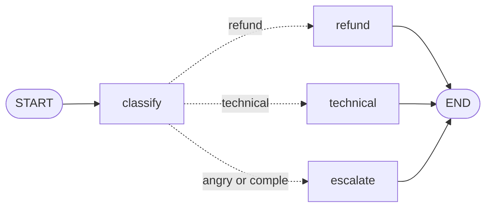

# Quick start

## The idea

There are three words to learn:

| Word | What it is | In the quick start below |
|---|---|---|
| **State** | The data of one job. A `data class` that you design. | A support email: who sent it, what it says, its category, the reply |
| **Node** | One step of the work. A function that receives the state and returns an updated copy. | `classify`, `refund`, `technical`, `escalate` |
| **Edge** | An arrow from one node to the next. A *conditional* edge chooses the next node by looking at the state. | After `classify`, go to the node of the email's category |

Every run begins at `START` and finishes at `END`.

## A support agent for email


A customer support agent for email. It reads an email, decides which of three categories it belongs
to, and writes the reply for that category:

- **refund**: the customer wants money back,
- **technical**: something does not work,
- **escalation**: the customer is angry, or the email is too complex or unclear for an automatic
  reply, so a person takes over.



```kotlin
import dev.deeptelar.telar.*

enum class Category { REFUND, TECHNICAL, ESCALATION }

// The state: everything the graph knows about one email.
// It is immutable (only `val`): a node never changes it, it returns an updated copy.
data class SupportEmail(
    val sender: String,              // input
    val body: String,                // input
    val category: Category? = null,  // filled in by the "classify" node
    val reply: String = "",          // filled in by one of the reply nodes
)

// Decides what an email is about. A real agent would ask an AI model here (see the guide "AI models").
// Plain Kotlin keeps this example runnable without an API key.
fun categoryOf(body: String): Category {
    val text = body.lowercase()
    val angry = listOf("unacceptable", "furious", "worst", "!!").any { it in text }
    val wantsRefund = listOf("refund", "money back").any { it in text }
    val hasProblem = listOf("error", "crash", "not working").any { it in text }

    return when {
        angry -> Category.ESCALATION                      // an upset customer gets a person
        wantsRefund && hasProblem -> Category.ESCALATION  // two requests in one email: too complex
        wantsRefund -> Category.REFUND
        hasProblem -> Category.TECHNICAL
        else -> Category.ESCALATION                       // not sure what this is, so a person reads it
    }
}

// StateGraph<SupportEmail> { ... } describes the graph. The type says which state it works on.
val graph = StateGraph<SupportEmail> {
    // A node is a named step: it receives the state and returns an updated copy.
    // This one fills in `category` and leaves the rest of the email as it is.
    val classify = node("classify") { email -> email.copy(category = categoryOf(email.body)) }

    // One node per category. Each writes the reply; only one of them runs for a given email.
    val refund = node("refund") { email ->
        email.copy(reply = "Hi ${email.sender}, your refund is on its way. It takes 3 to 5 days.")
    }
    val technical = node("technical") { email ->
        email.copy(reply = "Hi ${email.sender}, please update the app and try again. Here is our guide.")
    }
    val escalate = node("escalate") { email ->
        email.copy(reply = "Hi ${email.sender}, a colleague from our team will reply to you personally today.")
    }

    // Every run begins at START. This edge says: run `classify` first.
    START then classify

    // A conditional edge picks the next node by looking at the state.
    // `targets` lists every node it may pick, so compile() can check that no node is left out.
    conditionalEdge(classify, targets = setOf(refund, technical, escalate)) { email ->
        when (email.category) {
            Category.REFUND -> refund        // return the node to run next
            Category.TECHNICAL -> technical
            else -> escalate
        }
    }

    // After the reply is written there is nothing left to do, so each path goes to END.
    refund then END
    technical then END
    escalate then END
}.compile() // Checks the graph (unknown names, nodes nothing leads to) and makes it runnable.

suspend fun main() {
    // invoke() runs the graph from START to END with this email as the starting state.
    val result = graph.invoke(SupportEmail(sender = "Ana", body = "I was charged twice, I would like a refund."))

    // result.state is the final state: the email, with `category` and `reply` filled in.
    println("${result.state.category}: ${result.state.reply}")
    // REFUND: Hi Ana, your refund is on its way. It takes 3 to 5 days.
}
```

This is the [`QuickStart`](https://github.com/deeptelar/telar/blob/main/samples/src/main/kotlin/dev/deeptelar/telar/samples/QuickStart.kt) sample. To
run it from a clone of the [repository](https://github.com/deeptelar/telar):

```bash
./gradlew :samples:runQuickStart
```

```
REFUND: Hi Ana, your refund is on its way. It takes 3 to 5 days.
TECHNICAL: Hi Ben, please update the app and try again. Here is our guide.
ESCALATION: Hi Cleo, a colleague from our team will reply to you personally today.
```

## Next

- Add the library to your own project: [Installation](installation.md).
- Let a model do the work of `classify`, or call your functions: [AI models](guides/ai-models.md)
  and [Agents with tools](guides/agents-with-tools.md).
- Show progress, wait for a person, run steps at the same time: the [guides](guides/index.md).
- Learn every move slowly, with a small task after each one: the [tutorial](tutorial/).
