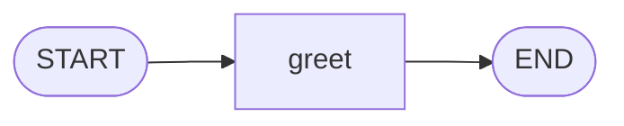
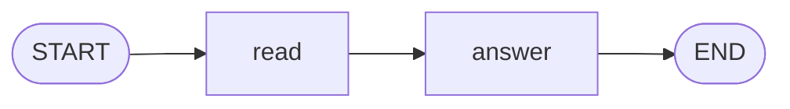

# Level 1: A line of nodes

**Goal:** the help desk first works out what the message is about, then writes a reply that uses it.

**New moves:** `StateGraph`, `node`, `then`, `compile`, `invoke`, and state that grows as it
travels.

The level starts with the smallest graph there is, one node, and then puts two nodes in a row.

## The smallest graph



[`level1/Level1.kt`](../../samples/src/main/kotlin/dev/deeptelar/telar/samples/tutorial/level1/Level1.kt)

```kotlin
import dev.deeptelar.telar.CompiledGraph
import dev.deeptelar.telar.END
import dev.deeptelar.telar.START
import dev.deeptelar.telar.StateGraph

data class Ticket(
    val customer: String,
    val message: String,
    val topic: String = "",
    val reply: String = "",
)

fun greeter(): CompiledGraph<Ticket> =
    StateGraph<Ticket> {
        val greet = node("greet") { ticket -> ticket.copy(reply = "Hi ${ticket.customer}, thanks for writing to Pixel Pizza!") }

        START then greet then END
    }.compile()

suspend fun main() {
    val greeted = greeter().invoke(Ticket(customer = "Ana", message = "Where is my pizza?"))
    println(greeted.state.reply)
}
```

Read it from top to bottom:

**The state.** `Ticket` is the backpack. `customer` and `message` are filled in at the start.
`topic` and `reply` start empty (`= ""`) because nodes will fill them in. This first graph only
fills in the reply.

**`StateGraph<Ticket> { ... }`** starts a new map whose state is a `Ticket`. Everything between the
braces describes the map.

**`node("greet") { ticket -> ... }`** adds a node. It has a name, `"greet"`, and a function. The
function receives the current ticket and returns a new one. `ticket.copy(reply = ...)` means "the
same ticket, but with this reply". `node` gives back a handle, stored in `greet`, that you use to
draw arrows.

**`START then greet then END`** draws two arrows: from `START` to `greet`, and from `greet` to
`END`. Read it aloud and it says what it does.

**`.compile()`** checks the map and turns it into something you can run, a `CompiledGraph`. If the
map has a mistake, such as an arrow to a node that does not exist, `compile()` tells you here,
before anything runs. You compile once and can then run the graph as often as you like.

**`invoke(...)`** plays one run. You give it the starting state and it returns the result when the
run reaches `END`. `greeted.state` is the final ticket.

**`suspend`.** `invoke` is a `suspend` function. That is Kotlin's way of marking a function that may
wait (for a model, for a network) without blocking the program. You can only call it from another
`suspend` function, which is why `main` is marked `suspend` too. Node functions are `suspend` as
well, so a node may wait for as long as it needs.

## The map

Now the real help desk of this level. It has two nodes, and the second uses what the first found
out.



## The code

The same file, further down. Imports are left out from here on; the files have them.

```kotlin
fun topicOf(message: String): String =
    when {
        "refund" in message.lowercase() -> "refund"
        "where" in message.lowercase() -> "delivery"
        else -> "other"
    }

fun helpDesk(): CompiledGraph<Ticket> =
    StateGraph<Ticket> {
        val read = node("read") { ticket -> ticket.copy(topic = topicOf(ticket.message)) }
        val answer = node("answer") { ticket -> ticket.copy(reply = "Hi ${ticket.customer}, we got your ${ticket.topic} question.") }

        START then read then answer then END
    }.compile()

suspend fun main() {
    val result = helpDesk().invoke(Ticket(customer = "Ana", message = "Where is my pizza?"))
    println("topic: ${result.state.topic}")
    println("reply: ${result.state.reply}")
}
```

`topicOf` stands in for an AI model. A real help desk would ask a model "what is this message
about?". Here it looks for a keyword, which is enough to learn how graphs work. Level 6 shows a
node that asks a model.

## Run it

```bash
./gradlew :samples:runLevel1
```

```
Hi Ana, thanks for writing to Pixel Pizza!

topic: delivery
reply: Hi Ana, we got your delivery question.
```

The first line comes from the smallest graph, the other two from the line of nodes.

## What happened

The ticket travelled along the arrows and each node added one thing:

| Moment | `topic` | `reply` |
|---|---|---|
| You call `invoke` | (empty) | (empty) |
| After `read` | `delivery` | (empty) |
| After `answer` | `delivery` | `Hi Ana, we got your delivery question.` |

`answer` could use `ticket.topic` because `read` ran before it and put the topic in the backpack.
That is how nodes work together: they never call each other. Each one reads what it needs from the
state and writes its result into the state.

### Why `copy`?

A node does not change the ticket it receives. It returns a new ticket made with `copy`, which
means "the same, except for these fields". The state is never edited in place, and there is a
reason for this rule:

- When two nodes run at the same time (level 4), each gets its own untouched ticket, so they cannot
  spoil each other's work.
- The engine can save the state after every step (level 5) and be sure nobody changes it afterwards.

So declare every field of your state with `val`, and use read-only collections such as `List`.

### Order

The order in which you write the `node(...)` lines does not matter. The arrows decide what runs
when.

## Your turn

1. In `greeter`, change the greeting so it repeats the customer's message, for example
   `Hi Ana, you asked: Where is my pizza?`. The message is in `ticket.message`.
2. Run `helpDesk` for two customers. Call `helpDesk()` once, keep the graph in a `val`, and call
   `invoke` twice with different tickets.
3. Add a third node to `helpDesk`, `sign`, that runs after `answer` and adds a signature to the
   reply. You need two changes: a new node, and one more stop in the line of arrows.

<details>
<summary>Show a solution for 3</summary>

```kotlin
val sign = node("sign") { ticket -> ticket.copy(reply = ticket.reply + " The Pixel Pizza team") }

START then read then answer then sign then END
```

</details>

## Level complete

You can now:

- describe a state as a `data class`, add nodes and connect them from `START` to `END`,
- compile a graph and run it with `invoke`,
- let a later node use what an earlier node found out,
- explain why nodes return a copy instead of changing the state.

[Back to the idea](00-the-idea.md) · [All levels](README.md) · Next: [Level 2, choices](02-choices.md)
