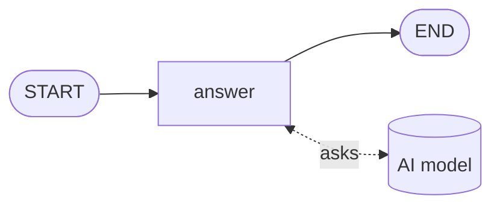
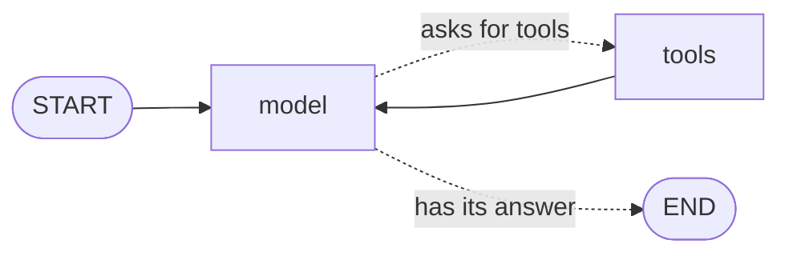

# Level 6: The agent

**Goal:** an AI model writes the reply, and looks up the order and the price by itself first.

**New moves:** `ChatModel`, `chat`, `Tool`, `toolAgent`, `toolLoop`.

Until now, small Kotlin functions pretended to be the AI. You have built choices, loops, parallel
work and pauses without a model, which shows what the library really is: it organizes the work. A
model is one of the things a node can use to do its work.

This level has two parts. First a node asks a model for a reply. Then the model gets **tools**:
functions it may call when it needs to know something. A model that decides by itself which tools
to call, and how often, before it answers, is called an **agent**.

## A model in a node



The model is not on the map. It is outside, and the `answer` node talks to it.

[`level6/Level6.kt`](https://github.com/deeptelar/telar/blob/main/samples/src/main/kotlin/dev/deeptelar/telar/samples/tutorial/level6/Level6.kt)

```kotlin
fun replyDesk(model: ChatModel): CompiledGraph<Ticket> =
    StateGraph<Ticket> {
        val answer =
            node(
                "answer",
                work = { ticket ->
                    model.chat("Reply in one friendly sentence to ${ticket.customer}, who wrote: ${ticket.message}", system = HELP_DESK)
                },
            ) { ticket, reply -> ticket.copy(reply = reply) }

        START then answer then END
    }.compile()
```

`ChatModel` is a small type from the module `telar-agent`. It stands for any AI model, and
`model.chat(...)` sends it a text and returns the text it answers. The text you send is called a
*prompt*. `system` is a second text with standing instructions, here who the model works for.

The call is slow, so it is the `work` of the node, and the block after it writes the reply into the
ticket (level 4).

The graph takes the model as a parameter instead of creating it. This level passes a
`pretendModel`, ordinary Kotlin code that answers at once, so it runs anywhere and costs nothing.
Your tests should do the same. Asked "Where is my pizza?", it replies:

```
Thanks for your message! We are looking into it.
```

That is friendly and useless. The model knows nothing about Ana's order. In level 4 the help desk
did know, because *you* decided that every ticket needs a call to the kitchen and a call to the
driver. Tools let the model make that decision.

## The map



You know both moves on this map: a choice (level 2) and an arrow that goes back (level 3). You do
not have to draw it. The library has this graph ready-made.

## The code

```kotlin
@Serializable
data class OrderLookup(
    @Description("The customer's name, for example \"Ana\"") val customer: String,
)

@Serializable
data class MenuLookup(
    @Description("The item, for example \"cola\"") val item: String,
)

val menu = mapOf("margherita" to 9, "salad" to 6, "cola" to 2)

val orderStatus: Tool =
    Tool<OrderLookup>("order_status", "Returns where a customer's order is right now.") { lookup ->
        "The pizza for ${lookup.customer} left the oven and the driver is 5 minutes away."
    }

val menuPrice: Tool =
    Tool<MenuLookup>("menu_price", "Returns the price of one item on the menu.") { lookup ->
        val price = menu[lookup.item] ?: throw IllegalArgumentException("We do not sell ${lookup.item}.")
        "One ${lookup.item} costs $price euros."
    }

const val HELP_DESK = "You work at the help desk of Pixel Pizza. Never guess where an order is or what something costs."

fun helpDesk(model: ChatModel): CompiledGraph<AgentState> = toolAgent(model, tools = listOf(orderStatus, menuPrice), system = HELP_DESK)

suspend fun main() {
    val state = helpDesk(pretendModel).invoke(AgentState("I'm Ana. Where is my pizza, and how much is a cola?")).state
    state.messages.forEach { message -> println(describe(message)) }
}
```

The file also has the `pretendModel`, which asks for a tool when the question has a word it knows
and answers with what the tools returned, and `describe`, which turns one message into one line.

## Run it

```bash
./gradlew :samples:runLevel6
```

```
Thanks for your message! We are looking into it.

customer: I'm Ana. Where is my pizza, and how much is a cola?
model asks for: order_status {"customer":"Ana"}, menu_price {"item":"cola"}
order_status: The pizza for Ana left the oven and the driver is 5 minutes away.
menu_price: One cola costs 2 euros.
model: The pizza for Ana left the oven and the driver is 5 minutes away. One cola costs 2 euros.

Hi Ben! One salad costs 6 euros.
```

The first line is the model without tools. The next five are the conversation of the agent. The
last line is explained [further down](#the-agent-inside-your-own-graph).

## What happened

### A tool

A tool has three parts:

| Part | What you give it | Here |
|---|---|---|
| A name | How the model refers to the tool | `order_status` |
| A description | When to use it. The model reads this. | "Returns where a customer's order is right now." |
| A function | What your program does. It returns text. | A sentence about Ana's pizza |

The function takes an input class, such as `OrderLookup`. From that class the library builds a list
of the fields and their types, and sends it to the model together with the name and the
description. When the model asks for the tool, it fills in the fields, and your function receives
an `OrderLookup` that is ready to use.

`@Description` tells the model what a field is for. Write the descriptions with care: they are all
the model knows about your tool. `@Serializable` comes from kotlinx.serialization and needs its
Gradle plugin, which the repository already has.

### The loop

Read the conversation in the output again, line by line:

1. The `model` node sends the question to the model, with the list of tools. The model does not
   answer yet. It asks for two tools in one go.
2. The `tools` node runs both functions, at the same time, as in level 4. Their results are added
   to the conversation.
3. The `model` node sends the conversation again, now with the results. This time the model writes
   its answer and asks for nothing, so the run goes to `END`.

The model never runs your function. It only asks, and your program does the work. That is why you
stay in control of what a tool is allowed to do.

`toolAgent(model, tools, system)` returns a `CompiledGraph`, like every `helpDesk()` before. So
everything you have learned works with it: `invoke`, `stream`, save points and `resume`.

### The state

The state of this graph is an `AgentState`. It holds the conversation as a list of messages, and
there are three kinds:

| Message | Who wrote it | What it carries |
|---|---|---|
| `ChatMessage.User` | The customer | Text |
| `ChatMessage.Assistant` | The model | Text, or the tools it asks for (`toolCalls`) |
| `ChatMessage.ToolResult` | Your tool | The text your function returned |

`state.answer` is the text of the model's last message. To continue the conversation, add the next
question and run the agent again:

```kotlin
val next = helpDesk(pretendModel).invoke(state.withUserMessage("And a salad?")).state
```

### When a tool fails

`menuPrice` throws an exception for an item that is not on the menu. That does **not** stop the
run. The model gets the message of the exception as the result of the tool, and it can react: tell
the customer, or try again with another input.

```
customer: Do you sell tiramisu?
model asks for: menu_price {"item":"tiramisu"}
menu_price: We do not sell tiramisu.
model: We do not sell tiramisu.
```

So write the message of such an exception for the model to read.

### The agent inside your own graph

`toolAgent` is a whole graph with its own state. Often the agent is one part of a larger graph, and
the state is yours. `toolLoop` adds the same two nodes to any graph:

```kotlin
data class Ticket(
    val customer: String,
    val message: String,
    val conversation: List<ChatMessage> = emptyList(),
    val reply: String = "",
)

fun ticketDesk(model: ChatModel): CompiledGraph<Ticket> =
    StateGraph<Ticket> {
        val send = node("send") { ticket -> ticket.copy(reply = "Hi ${ticket.customer}! ${ticket.conversation.last().text}") }
        val agent =
            toolLoop(
                model = model,
                tools = listOf(orderStatus, menuPrice),
                messages = { ticket -> ticket.conversation },
                append = { ticket, new -> ticket.copy(conversation = ticket.conversation + new) },
                firstMessage = { ticket -> "I'm ${ticket.customer}. ${ticket.message}" },
                system = HELP_DESK,
                then = send,
            )

        START then agent
        send then END
    }.compile()
```

| Part | What you give it | Here |
|---|---|---|
| `messages` | Where the conversation is in your state | The field `conversation` |
| `append` | How to add new messages to it | A copy of the ticket with a longer list |
| `firstMessage` | The message that starts the conversation, built from other fields | The customer's name and message |
| `then` | Where the graph goes when the model has its answer | The `send` node. Without it, `END`. |

`toolLoop` returns the handle of its `model` node, so you connect it like any other node:
`START then agent`. That is the last line of the output:

```
Hi Ben! One salad costs 6 euros.
```

### Watching the answer arrive

A real model writes its answer word by word, and a person would rather read along than wait. Run
the agent with `stream` from level 4, and each event that carries a piece of the answer has it in
`textDelta`:

```kotlin
helpDesk(model).stream(AgentState("How much is a cola?")).collect { event ->
    event.textDelta?.let { piece -> print(piece) }
}
```

It needs `import dev.deeptelar.telar.agent.textDelta`. For every other event `textDelta` is `null`. The
pretend model has nothing to write slowly, so its whole answer arrives as one piece.

### Plugging in a real model

Build a real `ChatModel` and pass it in. Nothing else changes.

```kotlin
// Claude, on every platform. From the module telar-anthropic; HttpClient is the Ktor client.
val model: ChatModel = AnthropicChatModel(HttpClient(), apiKey = System.getenv("ANTHROPIC_API_KEY"), model = "claude-opus-5-5")

// OpenAI, on every platform. From the module telar-openai.
val model: ChatModel = OpenAiChatModel(HttpClient(), apiKey = System.getenv("OPENAI_API_KEY"), model = "gpt-5")

// A model that Ollama runs on your own machine. No account and no key. Also from telar-openai.
val model: ChatModel = OpenAiChatModel.ollama(HttpClient(), model = "llama3.2")

// Most other models, on the JVM, through LangChain4j. From the module telar-langchain4j.
val model: ChatModel = LangChain4jChatModel(GoogleAiGeminiChatModel.builder().apiKey(System.getenv("GEMINI_API_KEY")).modelName("gemini-3.8-flash").build())

val state = helpDesk(model).invoke(AgentState("I'm Ana. Where is my pizza?")).state
```

A model can take a while. A call to `AnthropicChatModel` or `OpenAiChatModel` may take five minutes;
pass a `timeout` to change that.

This snippet is not part of the runnable level, because it needs an account and a key, or a model
on your machine. Keep the key out of your source code; read it from an environment variable as
shown. The
[ToolAgent sample](https://github.com/deeptelar/telar/blob/main/samples/src/main/kotlin/dev/deeptelar/telar/samples/ToolAgent.kt) is this help
desk with a real model: Claude when `ANTHROPIC_API_KEY` is set, OpenAI when `OPENAI_API_KEY` is set,
a model of Ollama when `OLLAMA_MODEL` names one, and a pretend one otherwise. The guide [AI models](../guides/ai-models.md) has more.

### What changes when the model is real

- **It is slow.** A call takes seconds. Level 4 lets you show progress and make several calls at
  once.
- **It is not always right.** That is what the loop of level 3 is for, and the pause of level 5.
- **It can fail.** The network drops, the provider is busy. That is the next level.
- **It costs money.** Every call does. Asking for tools and getting the results is one round of the
  agent, and it takes two steps, so the default `maxIterations` of 25 allows twelve rounds.
- **Its tools act for you.** Ask a person before a tool does something that cannot be undone. The
  node that runs the tools is named `tools`, so `interruptBefore = setOf("tools")` from level 5
  pauses the run before any tool runs. The guide [Agents with tools](../guides/agents-with-tools.md) shows how to read the calls
  that wait and how to say no.

## Your turn

1. Change the question in `main` to "Do you sell tiramisu?" and run the level. Find the line where
   the tool fails, and the line where the model reacts to it.
2. Add `"pepperoni" to 11` to the menu and ask what a pepperoni costs.
3. Write a third tool, `opening_hours`, with an input class that has a `day`, and add it to the
   list in `helpDesk`. The pretend model does not know it. Teach it: in `pretendModel`, add a call
   to your tool when the question contains "open".
4. If you have an API key, plug in a real model as shown above.

## Level complete

You can now:

- make a node that asks an AI model, and swap a pretend model for a real one without touching the
  graph,
- write a tool and build an agent with `toolAgent`,
- put the agent inside a graph of your own with `toolLoop`.

[Back to level 5](05-save-points.md) · [All levels](./) · Next: [Level 7, game over screens](07-game-over-screens.md)
